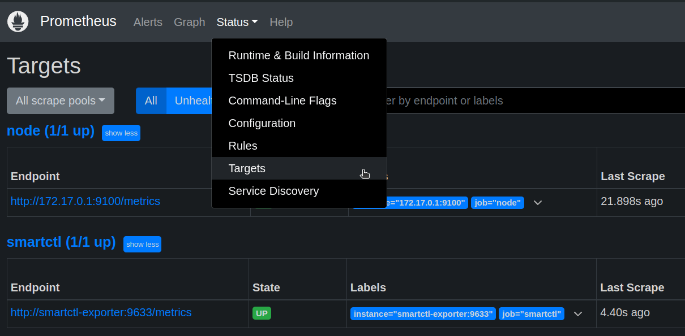
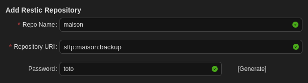

# Système d'exploitation

Nous avons personnellement choisi **Ubuntu Server minimized**, majoritairement pour des questions d'habitude, mais bien sûr n'importequel Linux fera l'affaire.

## Configuration d'une IP fixe

Il est conseillé pour faciliter l'utilisation du serveur de lui attribuer une IP fixe.  
Pour ce faire, le plus simple est de configurer un bail DHCP sur le routeur.
Mais il est aussi possible de la fixer sur le serveur, voici la marche à suivre sur Ubuntu 22 :

- Installer `network-manager`

```bash
sudo apt install network-manager
```

- Déterminer l'identifiant de la carte réseau

```bash
ip a
```


- Modifier le fichier de configuration

```bash
# Sauvegarde du fichier actuel
sudo cp /etc/netplan/50-cloud-init.yaml /etc/netplan/50-cloud-init.yaml.bak
sudo nano /etc/netplan/50-cloud-init.yaml
```

- On renseigne le fichier de la façon suivante

**50-cloud-init.yaml**

```yml
network:
  version: 2
  renderer: NetworkManager
  ethernets:
    eth0: # Identifiant de la carte réseau 
      addresses: [192.168.1.200/24] # IP souhaitée
      routes:
        - to: default
          via: 192.168.1.254 # IP du routeur Freebox Révolution
      nameservers:
        addresses: [8.8.8.8, 8.8.4.4] # Serveur DNS Google
      dhcp4: false
      dhcp6: false
```

- Redémarrage du service

```bash
# On applique les changements
sudo netplan apply
# On redémarre le service
sudo systemctl restart systemd-networkd
```

## LVM

Par défaut, certains OS réservent une **part inférieure** à l'espace total disponible du disque pour la création du **système de fichier principal**; ceci pour plusieurs raisons (notamment de flexibilité, performance et sécurité). C'est pour cette raison que **LVM** est souvent utilisé par défaut.

En cas de **saturation** d'un volume LVM utilisé pour le système de fichier de l'OS:

```sh
df -h
```
```sh
Filesystem                         Size  Used Avail Use% Mounted on
#...
/dev/mapper/ubuntu--vg-ubuntu--lv   98G   85G    9G  90% /
#...
```
Le volume `/dev/mapper/ubuntu--vg-ubuntu--lv` est ici **utilisé à 90%**. Il est temps de l'étendre

```
sudo vgs
```
```
  VG        #PV #LV #SN Attr   VSize    VFree   
  ubuntu-vg   1   1   0 wz--n- <463.76g <363.76g
```
Comme nous pouvons le voir, nous disposons de **~364G supplémentaires**

L'extention est très simple:

```sh
sudo lvextend -L +100G -r /dev/mapper/ubuntu--vg-ubuntu--lv
```
```
  Size of logical volume ubuntu-vg/ubuntu-lv changed from 100.00 GiB (25600 extents) to 200.00 GiB (51200 extents).
  Logical volume ubuntu-vg/ubuntu-lv successfully resized.
resize2fs 1.47.0 (5-Feb-2023)
Filesystem at /dev/mapper/ubuntu--vg-ubuntu--lv is mounted on /; on-line resizing required
old_desc_blocks = 13, new_desc_blocks = 25
The filesystem on /dev/mapper/ubuntu--vg-ubuntu--lv is now 52428800 (4k) blocks long.
```

Nous venons d'**ajouter 100Go** au volume avec l'option `-L` et d'**étendre le système de fichier** avec `-r`

[Source](https://4sysops.com/archives/extending-lvm-space-in-ubuntu/)

## Gestion des services

Les services mentionnés [dans le chapitre suivant](#services) utilisent tous **Docker** avec son extention **Compose**.

Il est conseillé d'installer Docker en suivant la [documentation officielle](https://docs.docker.com/engine/install/ubuntu/) pour éviter de se retrouver avec une ancienne version ou modifiée par le mainteneur du gestionnaire de dépendances.  
Pour en simplifier l'utilisation, ne pas oublier de s'ajouter au groupe `docker` après l'installation:

```bash
sudo usermod -aG docker $USER
```

Nous proposons ici une manière simple d'installer et de gérer les services, sans aller jusqu'à utiliser des outils comme Kubernetes qui seraient sans doute surdimentionnés pour une utilisation privée:

- Définir des fonctions pour gérer les services

```
nano ~/.bash_aliases
```

```sh
alias compose='docker compose'

compose_do() {
  if [ $# -eq 2 ]
    then
      compose --project-directory ~/$2 $1
    else
      compose $1
  fi
}

up() {
  compose_do "up -d" $1
}

down() {
  compose_do down $1
}

pull() {
  compose_do pull $1
}

update() {
  pull $1
  up $1
}
```

Ces fonctions fournissent des raccourcis pour gérer les services. L'avantage est qu'on peut utiliser la complétion du système de fichier pour récupérer le nom des stacks

- Pour chaque service, créer un répertoire depuis le `home` de l'utilisateur principal (pour y avoir accès facilement à la connexion SSH)

```
mkdir ~/<service>
```

- Créer la stack pour le service

```
nano ~/<service>/compose.yml
```

### Alias `compose`

Défini plus haut dans notre `~/.bash_aliases`. Ici avec Plex

```
~/plex$ compose ps
NAME      IMAGE                COMMAND   SERVICE   CREATED       STATUS                PORTS
plex      plexinc/pms-docker   "/init"   plex      12 days ago   Up 4 days (healthy)   
```

```sh
~/plex$ compose logs
plex  | [s6-init] making user provided files available at /var/run/s6/etc...exited 0.
plex  | [s6-init] ensuring user provided files have correct perms...exited 0.
plex  | [fix-attrs.d] applying ownership & permissions fixes...
plex  | [fix-attrs.d] done.
#[...]
```

### Lancer une stack

Depuis le home de l'utilisateur

```
~$ up <service>
```

ou depuis le répertoire du service

```
~/service$ up
```

### Stopper une stack

Depuis le home de l'utilisateur

```
~$ down <service>
```

ou depuis le répertoire du service

```
~/service$ down
```

### Mettre à jour une stack

Depuis le home de l'utilisateur

```
~$ update <service>
```

ou depuis le répertoire du service

```
~/service$ update
```

### Mise à jour globale

Script de mise à jour de tous les services Docker hébergés sur le NAS.

On suppose que tous les services sont dans un même répertoire "/chemin/des/projets/"

```bash
#!/bin/bash

# Répertoire contenant les projets Docker Compose
PROJECTS_DIR="/chemin/des/projets/"

# Vérifie si le répertoire existe
if [ ! -d "$PROJECTS_DIR" ]; then
  echo "Le répertoire $PROJECTS_DIR n'existe pas. Veuillez vérifier le chemin."
  exit 1
fi

# Parcours les sous-répertoires contenant un fichier compose.yml
for project_dir in "$PROJECTS_DIR"/*; do
  # Vérifie si c'est bien un dossier et s'il contient un fichier docker-compose.yml
  if [ -d "$project_dir" ] && [ -f "$project_dir/compose.yml" ]; then
    echo "Traitement du projet dans le répertoire $project_dir"

    # Va dans le répertoire du projet
    cd "$project_dir" || continue

    # Arrête les conteneurs
    docker compose down

    # Récupère les dernières versions des images
    docker compose pull

    # Relance les services
    docker compose up -d

    echo "Mise à jour du projet dans $project_dir terminée"
  else
    echo "Aucun compose.yml trouvé dans $project_dir, ou ce n'est pas un dossier valide."
  fi
done

echo "Mise à jour de tous les projets terminée."
```

```
chmod +x monscript.sh
```

# Services

[Liste réputée et maintenue de services auto-hébergés](https://github.com/awesome-selfhosted/awesome-selfhosted)

## Surveillance

Plusieurs choses sont intéressantes à surveiller, exemples:

- Les **températures**
  - Disques
  - HBA
  - CPU
- L'état des **raids**
- Les **débits réseau** entrant et sortant
- L'**espace disque** restant pour l'OS et les données
- La consommation de la **mémoire**

### Prometheus & Grafana

2 outils sont mis à contribution:
- **Prometheus** pour la récupération des données
- **Grafana** pour l'affichage

Et des collecteurs ("exporters") sont là pour **récupérer les données** régulièrement et les envoyer à Prometheus.

Voila un exemple de config:

**compose.yml**

```yml
services:

  node-exporter: # Métriques principales
    container_name: node-exporter
    image: quay.io/prometheus/node-exporter:latest
    restart: unless-stopped
    command:
      - --path.rootfs=/host
    pid: host
    volumes:
      - /etc/localtime:/etc/localtime:ro
      - /etc/timezone:/etc/timezone:ro
      - /:/host:ro,rslave
    network_mode: host

  zpool-exporter: # À utiliser en cas de ZFS (Raid-Z)
    container_name: zpool-exporter
    image: ghcr.io/jrcichra/zpool-status-prometheus-exporter
    restart: unless-stopped
    privileged: true
    volumes:
      - /etc/localtime:/etc/localtime:ro
      - /etc/timezone:/etc/timezone:ro

  smartctl-exporter: # Disques
    container_name: smartctl-exporter
    image: prometheuscommunity/smartctl-exporter
    restart: unless-stopped
    privileged: true
    user: root

  cadvisor-exporter: # Services Docker
    image: gcr.io/cadvisor/cadvisor:latest
    container_name: cadvisor
    volumes:
    - /:/rootfs:ro
    - /var/run:/var/run:rw
    - /sys:/sys:ro
    - /var/lib/docker/:/var/lib/docker:ro

  prometheus:
    container_name: prometheus
    image: prom/prometheus
    restart: unless-stopped
    volumes:
      - "./prometheus.yml:/etc/prometheus/prometheus.yml"
      - "prometheus-data:/prometheus"
    ports:
      - 9090:9090

  grafana:
    container_name: grafana
    image: grafana/grafana
    restart: unless-stopped
    depends_on:
      - prometheus
    ports:
      - 3000:3000
    volumes:
      - grafana-data:/var/lib/grafana

volumes:
    prometheus-data:
    grafana-data:
```

- `node-exporter` récupère les **métriques classiques du système**, il doit tourner directement sur le contexte de l'hôte pour avoir accès au matériel de manière non cloisonnée
- `smartctl-exporter` récupère les métriques des **disques**
- `cadvisor-exporter` collecte les données relatives à **Docker**
- `zpool-exporter`: données concernant l'état du **Raid-Z** (Si applicable, sinon exclure le service de la stack)
- `prometheus` **rassemble les données** et les met à disposition de Grafana
- `grafana` vient **lire les données** sur Prometheus, les **présenter graphiquement** et éventuellement **notifier des alertes**

**prometheus.yml**

```yml
global:
  scrape_interval: 15s

scrape_configs:
  - job_name: node
    static_configs:
    - targets:
      - 172.17.0.1:9100
  - job_name: smartctl
    static_configs:
    - targets:
      - smartctl-exporter:9633
  - job_name: cadvisor
    static_configs:
    - targets:
      - cadvisor-exporter:8080
  - job_name: zpool
    static_configs:
    - targets:
      - zpool-exporter:5000
```

Comme `node-exporter` tourne sur l'hôte, on utilise ici l'IP de l'hôte `172.17.0.1` par défaut définie par Docker.  
On est censé [pouvoir y accéder par `host.docker.internal`](https://stackoverflow.com/a/24326540/305189) mais ça n'a pas fonctionné chez moi.

Une fois les services lancés, vérifier sur le GUI de Prometheus (ici port 9090) que les agents (exporters) sont bien connectés dans l'onglet **Status/Target**.



#### Optimisation de `node-exporter`

Attention, le `node-exporter` peut dépasser le temps max de réponse pour prometheus (onglet **Status/Target** pour voir le temps de récupération des métriques "Last Scrape"). Dans ce cas il est possible de réduire le périmètre des métriques, exemple:

**compose.yml**

```yml
#...
  node-exporter:
    container_name: node-exporter
    image: quay.io/prometheus/node-exporter:latest
    restart: unless-stopped
    command:
      - --path.rootfs=/host
      - --collector.disable-defaults
      - --collector.cpu
      - --collector.filesystem
      - --collector.meminfo
      - --collector.hwmon
      - --collector.netdev
    pid: host
    volumes:
      - /etc/localtime:/etc/localtime:ro
      - /etc/timezone:/etc/timezone:ro
      - /:/host:ro,rslave
    network_mode: host
#...
```

_La liste des collecteurs est visible sur le [répo de `node_exporter`](https://github.com/prometheus/node_exporter?tab=readme-ov-file#collectors)_

Il est aussi possible d'augmenter le délai d'expiration

**prometheus.yml**

```yml
#...
  - job_name: node
    scrape_interval: 40s
    scrape_timeout: 20s
#...
```

#### Optimisation de cAdvisor

cAdvisor semble avoir une [utilisation de CPU relativement élevée](https://github.com/google/cadvisor/issues/2523). Il extiste des possibilités de la réduire:

- Dans le `compose.yml` alonger l'interval de ["housekeeping"](https://github.com/google/cadvisor/blob/master/docs/runtime_options.md#housekeeping) à 10s (1s par défaut), et activer l'option [`docker_only`](https://github.com/google/cadvisor/blob/master/docs/runtime_options.md#limiting-which-containers-are-monitored)

```yml
  cadvisor-exporter:
#...
    command:
      - '-housekeeping_interval=10s'
      - '-docker_only=true'
```

- Dans le `prometheus.yml` alonger l'interval de récupération des données

```yml
  - job_name: cadvisor
    scrape_interval: 30s
#...
```

#### Exemple de tableau de bord


## Samba/CIFS

Voilà une manière simple de créer une instance Samba avec Docker

**compose.yml**

```yml
services:
  samba:
    image: ghcr.io/servercontainers/samba:latest
    container_name: samba
    restart: unless-stopped
    environment:
      ACCOUNT_me: <hash-user>
      SAMBA_VOLUME_CONFIG_vol1: |
        [vol1]
          path = /volume1
          valid users = me
          read only = no
    volumes:
      - /volume1:/volume1
    ports:
      - 445:445
```

Replacer les occurrences de `me` et `volume1` respectivement par l'utilisateur et le partage voulus.

Générer le `<hash-user>` avec la commande suivante:

```
docker run -ti --rm --entrypoint create-hash.sh ghcr.io/servercontainers/samba
```

Plus d'information sur le [Github](https://github.com/ServerContainers/samba)

## Photos

[Immich](https://github.com/immich-app/immich) est un système de gestion de photos moderne et populaire, il permet (parmi [tant d'autres fonctionnalités](https://github.com/immich-app/immich?tab=readme-ov-file#features)) de:
- Parcourir les photos par chronologie (à la Google photo) ou par album
- Créer des albums et les partager
- Automatiser la sauvegarde des photos des téléphones
- Reconnaitre les visages, formes, objets, couleur et attacher des metadonnées en conséquence

**compose.yml**

```yml
services:
  immich-server:
    container_name: immich_server
    image: ghcr.io/immich-app/immich-server:${IMMICH_VERSION:-release}
    command: ['start.sh', 'immich']
    volumes:
      - ${UPLOAD_LOCATION}:/usr/src/app/upload
      - /etc/localtime:/etc/localtime:ro
      - /volume1/Photos:/volume1/Photos:ro
    env_file:
      - .env
    ports:
      - 2283:2283
    depends_on:
      - redis
      - database
    restart: unless-stopped

  immich-machine-learning:
    container_name: immich_machine_learning
    # For hardware acceleration, add one of -[armnn, cuda, openvino] to the image tag.
    # Example tag: ${IMMICH_VERSION:-release}-cuda
    image: ghcr.io/immich-app/immich-machine-learning:${IMMICH_VERSION:-release}
    # extends: # uncomment this section for hardware acceleration - see https://immich.app/docs/features/ml-hardware-acceleration
    #   file: hwaccel.ml.yml
    #   service: cpu # set to one of [armnn, cuda, openvino, openvino-wsl] for accelerated inference - use the `-wsl` version for WSL2 where applicable
    volumes:
      - model-cache:/cache
    env_file:
      - .env
    restart: unless-stopped

  redis:
    container_name: immich_redis
    image: registry.hub.docker.com/library/redis:6.2-alpine@sha256:84882e87b54734154586e5f8abd4dce69fe7311315e2fc6d67c29614c8de2672
    restart: unless-stopped

  database:
    container_name: immich_postgres
    image: registry.hub.docker.com/tensorchord/pgvecto-rs:pg14-v0.2.0@sha256:90724186f0a3517cf6914295b5ab410db9ce23190a2d9d0b9dd6463e3fa298f0
    environment:
      POSTGRES_PASSWORD: ${DB_PASSWORD}
      POSTGRES_USER: ${DB_USERNAME}
      POSTGRES_DB: ${DB_DATABASE_NAME}
    volumes:
      - ${DB_DATA_LOCATION}:/var/lib/postgresql/data
    restart: unless-stopped

  immich-folder-album-creator:
    container_name: immich_folder_album_creator
    image: salvoxia/immich-folder-album-creator:latest
    restart: unless-stopped
    environment:
      API_URL: http://immich_server:3001/api
      API_KEY: <api-key> # À générer depuis l'admin dans le GUI d'Immich
      ROOT_PATH: /volume1/Photos
      CRON_EXPRESSION: "42 17 * * *"
      TZ: Europe/Paris
    volumes:
      - /volume1/Photos:/volume1/Photos:ro
    profiles:
      - donotstart

  backup:
    container_name: immich_db_dumper
    image: prodrigestivill/postgres-backup-local:14
    restart: unless-stopped
    environment:
      POSTGRES_HOST: database
      POSTGRES_PASSWORD: ${DB_PASSWORD}
      POSTGRES_USER: ${DB_USERNAME}
      POSTGRES_DB: ${DB_DATABASE_NAME}
      POSTGRES_CLUSTER: 'TRUE'
      POSTGRES_EXTRA_OPTS: '--clean --if-exists'
      BACKUP_DIR: /backups
      SCHEDULE: "@daily"
      BACKUP_KEEP_DAYS: 1
      BACKUP_KEEP_WEEKS: 1
      BACKUP_KEEP_MONTHS: 1
    volumes:
      - ${DB_BACKUP_LOCATION}:/backups
    depends_on:
      - database

volumes:
  model-cache:
```

Le service `immich-folder-album-creator` est optionnel. Il permet, comme son nom l'indique, de générer des albums à partir de répertoires existants.

**.env**

```env
UPLOAD_LOCATION=/volume1/immich/library
DB_DATA_LOCATION=/volume1/immich/postgres

IMMICH_VERSION=release

DB_PASSWORD=<pass>

DB_USERNAME=postgres
DB_DATABASE_NAME=<user>
```

Pour ajouter une librairie de fichiers existants:

- Monter le répertoire de photos dans le service `immich-server`
- Se rendre dans l'**Administration**
- Puis dans **Bibliothèques externes**
- **Créer une bibliothèque**
- Dans le menu contextuel de la bibliothèque **Modifier les chemins d'importation**
- **Ajouter un chemin**
- Et enfin **Analyser les nouveaux fichiers**

Ces derniers devraient commencer à apparaitre dans la page d'accueil. Il est possible de consulter la progression de l'importation dans les **Tâches** de l'**Administration**


## VPN

Stack pour [Wireguard](https://github.com/linuxserver/docker-wireguard)

**compose.yml**

```yml
services:
  wireguard:
    image: lscr.io/linuxserver/wireguard:1.0.20210914
    container_name: wireguard
    restart: unless-stopped
    cap_add:
      - NET_ADMIN
      - SYS_MODULE
    environment:
      - PUID=1000
      - PGID=1000
    volumes:
      - ./config:/config
    ports:
      - 51820:51820/udp
```

## Gestionnaire de mots de passe

Stack pour [Vaultwarden](https://github.com/dani-garcia/vaultwarden)

**compose.yml**

```yml
services:
  vaultwarden:
    image: vaultwarden/server:1.30.5
    restart: unless-stopped
    container_name: vaultwarden
    volumes:
      - ./data:/data
#    ports:
#      - 3012:80
    environment:
      - TZ=Europe/Paris
#      - SIGNUPS_ALLOWED=false

networks:
  default:
    name: traefik # Avec par exemple Traefik comme reverse proxy (Exemple dans la section Traefik)
    external: true
```

* Lancer les services

```
docker compose up -d
```

* **Ouvrir l'application** avec un navigateur (nom de domaine configuré sur træfik sinon directement sur le port `3012` arbitraire)
* **Créer un utilisateur** depuis le lien d'inscription
* Décommenter la variable  `SIGNUPS_ALLOWED` du `compose.yml`
* Relancer le service
```
docker compose up -d
```

[Référence des variables](https://github.com/dani-garcia/vaultwarden/blob/main/.env.template)

### Page d'admin

La page d'admin offre un GUI permettant de gérer les utilisateurs et de configurer les options.
Les variables définies depuis Docker seraient alors écrasées.

* Générer le **jeton d'admin**

```
docker compose exec vaultwarden /vaultwarden hash
```

* Copier la ligne `ADMIN_TOKEN=...` dans un `.env`
* Ajouter la variable `ADMIN_TOKEN=${ADMIN_TOKEN}` dans le `compose.yml`
* Relancer le service
```
docker compose up -d
```
* Il devient alors possible d'accéder à l'admin avec un navigateur sur `https://<domaine>/admin`

_Plus d'informations [ici](https://github.com/dani-garcia/vaultwarden/wiki/Enabling-admin-page#secure-the-admin_token)_

## Reverse proxy

Voila l'installation que nous recommandons pour [Træfik](https://doc.traefik.io/traefik/). Elle a les avantages d'être facile à apréhender/maintenir par son découpage et de pouvoir surveiller les services à activer/désactiver et de manière centralisée.

**compose.yml**

```yml
services:
  traefik:
    image: traefik:v3.0.0
    restart: unless-stopped
    container_name: traefik
    environment:
      - TZ=Europe/Paris
      - XDG_CONFIG_HOME=/ # Permet de faire découvrir la config la où elle est montée (/traefik.yml)
    ports:
      - 80:80
      - 443:443
    volumes:
      - ./letsencrypt:/letsencrypt # Emplacement des certificat
      - ./routers:/routers # Répertoire surveillé contenant un fichier par router
      - ./traefik.yml:/traefik.yml # Config principale
      - /var/run/docker.sock:/var/run/docker.sock:ro

networks:
  default:
    name: traefik # Le réseau à rejoindre pour les "backends" concernés
    external: true
```

**traefik.yml**

```yml
log:
#  level: DEBUG
  level: INFO

providers:
  file:
    directory: /routers
    watch: true

entryPoints:
  web:
    address: ":80"
    http:
      redirections:
        entryPoint:
          to: "websecure"
          scheme: "https"
  websecure:
    address: ":443"

certificatesResolvers:
  my: # Nom arbitraire à changer si besoin
    acme:
      tlsChallenge: true
      email: "<mail-de-ladmin>"
      storage: "/letsencrypt/prod.json"
  staging: # Le staging permet de simuler la récupération d'un certificat sans consommer les tentatives potentiellement infructueuses (limitées)
    acme:
      tlsChallenge: true
      email: "<mail-de-ladmin>"
      storage: "/letsencrypt/staging-v2.json"
      caServer: "https://acme-staging-v02.api.letsencrypt.org/directory"
```

Exemple de router pour Vaulwarden

**routers/vaultwarden.yml**

```yml
http:
  routers:
    vaultwarden:
      service: vaultwarden
      rule: "Host(`vaultwarden.<mon-domaine>`)"
      entrypoints: websecure
      tls:
        certResolver: my
  services:
    vaultwarden:
      loadBalancer:
        servers:
          - url: "http://vaultwarden" # "vaultwarden" doit correspondre au nom du service Docker correspondant (son IP sera résolue par le DNS interne de Docker)
```

Bien sûr, il faut remplacer `<mon-domaine>` par le domaine concerné...

Même à chaud, pour ajouter un routeur, il suffit de créer un fichier dans le répertoire `routers` pour que la config soit prise en compte.

La syntaxe YML est plus lisible que les configurations exposées dans des labels sur les services Docker.

## Seedbox

Voila une composition qui permet d'utiliser [Transmission](https://github.com/transmission/transmission) avec **NordVPN** en mode Wireguard.

[Gluetun](https://github.com/qdm12/gluetun) est un client VPN léger qui accepte un grand nombre de protocoles et fournisseurs différents (comme NordVPN).

**compose.yml**

```yml
services:
  nordvpn:
    image: qmcgaw/gluetun
    container_name: torrent-nord
    restart: unless-stopped
    cap_add:
      - NET_ADMIN
    ports:
      - "9092:9091" # Transmission
      - "51413:51413" # Transmision
      - "51413:51413/udp" # Transmision
    environment:
      - VPN_SERVICE_PROVIDER=nordvpn
      - WIREGUARD_PRIVATE_KEY=${WIREGUARD_PRIVATE_KEY}
#      - SERVER_CITIES=Prague
      - VPN_TYPE=wireguard
  transmission:
    image: ghcr.io/linuxserver/transmission
    network_mode: "service:nordvpn"
    container_name: torrent-transmission
    restart: unless-stopped
    depends_on:
      - nordvpn
    environment:
      - PUID=1000
      - PGID=1000
      - TZ=Europe/Paris
    volumes:
      - "./config:/config"
      - "./downloads:/downloads"
      - "./watch:/watch"
```

**.env**

```
WIREGUARD_PRIVATE_KEY=<clé privée>
```

La clé privée Wireguard peut être générée avec un token de cette manière:

```
curl -s -u token:<ACCESS_TOKEN> https://api.nordvpn.com/v1/users/services/credentials
```

Pour utiliser [Qbittorrent](https://github.com/qbittorrent/qBittorrent) à la place de Transmission:

```yml
  qbittorrent:
    image: linuxserver/qbittorrent
    network_mode: "service:nordvpn"
    container_name: torrent-qbit
    restart: unless-stopped
    depends_on:
      - nordvpn
    environment:
      - WEBUI_PORT=8089
      - PUID=1000
      - PGID=1000
      - TZ=Europe/Paris
    volumes:
      - "./config:/config"
      - "./downloads:/downloads"
```

## Sauvegarde

Ici l'idée est d'utiliser [Restic](https://restic.readthedocs.io/en/stable/) avec un stockage en SFTP

### SFTP

Service SSH dockerisé à configurer sur la machine qui accueillira des sauvegardes

**compose.yml**

```yml
services:
  sftp:
    image: atmoz/sftp
    container_name: sftp
    restart: unless-stopped
    volumes:
      - ./sftp/users.conf:/etc/sftp/users.conf:ro
      - ./sftp/backup/<utilisateur>:/home/<utilisateur>/cible # Répertoire de sauvegarde
      - ./sftp/keys/ssh_host_rsa_key:/etc/ssh/ssh_host_rsa_key
      - ./sftp/keys/ssh_host_ed25519_key:/etc/ssh/ssh_host_ed25519_key
      - ./sftp/keys/sftp.<utilisateur>.pub:/home/<utilisateur>/.ssh/keys/id_rsa.pub
    ports:
      - "<port-sftp>:22"
```

- Créer les répertoires de config SSH et de sauvegarde

```
mkdir -p sftp/ssh
mkdir -p sftp/backup/<utilisateur>
```

- Définir les utilisateurs

```
echo "<utilisateur>::<uid>:<gid>:<repertoire>" >> sftp/users.conf

# Exemple
echo "me::1000:1000:cible" >> sftp/users.conf
```

- Créer les clés

```
ssh-keygen -t ed25519 -f sftp/ssh/ssh_host_ed25519_key < /dev/null
ssh-keygen -t rsa -b 4096 -f sftp/ssh/ssh_host_rsa_key < /dev/null
```

Plus d'infos sur le [Github](https://github.com/atmoz/sftp)

### Restic

Nous évoquerons deux versions, une avec GUI **Backrest** et une sans **Resticker**. 

#### Backrest

Backrest est un GUI au dessus de Restic (inclu dans le service).

**compose.yml**

```yml
services:
  restic:
    image: garethgeorge/backrest
    container_name: backrest
    restart: unless-stopped
    volumes:
      - ./backrest/data:/data
      - ./backrest/config:/config
      - ./backrest/cache:/cache
      - ./backrest/source:/source:ro # Données à sauvegarder
      - ./backrest/ssh:/root/.ssh # Config & clés SSH
    environment:
      - BACKREST_DATA=/data
      - BACKREST_CONFIG=/config/config.json
      - XDG_CACHE_HOME=/cache
      - TZ=Europe/Paris
    ports:
      - "9898:9898"
```

- Créer le répertoire de config SSH

```
mkdir -p backrest/ssh
```

- Générer les clés

```
ssh-keygen -f ./backrest/ssh/id_rsa
```

- Générer le `known_hosts`

```
ssh-keyscan -H -p <port-sftp> <domaine> > ./backrest/ssh/known_hosts
```

_Remplacer `<domaine>` et `<port-sftp>` par l'hôte et le port sur lequels les données seront sauvegardées_

- Créer la config SSH dans `backrest/ssh/config`

```
Host <alias>
  Hostname <domaine>
  User <utilisateur>
  Port <port-sftp>
```

- Appliquer les bonnes permissions

```
chmod 700 backrest/ssh
chmod 600 backrest/ssh/*
sudo chown -R root:root backrest/ssh/
```

- Une fois le service lancé, accéder au GUI avec un navigateur sur le port `9898`
- Créer un _Repo_ avec les paramètres suivants

```yml
uri: sftp:<alias>:backup
password: <mot-de-passe-pour-chiffrer-les-sauvegardes>
```

Exemple:



- Et enfin, créer un _Plan_ avec les données à sauvegarder (`/source` défini dans notre compose)

Plus d'infos sur le [Github](https://github.com/garethgeorge/backrest)

#### Resticker

Resticker est un Restic dockerisé sans GUI avec une configurations simplifiée dans des variables d'environnement.

**compose.yml**

```yml
services:
  restic:
    image: mazzolino/restic
    container_name: restic
    hostname: <hote-source>
    restart: unless-stopped
    environment:
#      RUN_ON_STARTUP: "true"
      BACKUP_CRON: "0 30 3 * * *"
      RESTIC_REPOSITORY: sftp:<alias>:backup
      RESTIC_PASSWORD: ${RESTIC_PASSWORD}
      RESTIC_BACKUP_SOURCES: /data
      RESTIC_BACKUP_ARGS: >-
        --verbose
      RESTIC_FORGET_ARGS: >-
        --keep-last 10
        --keep-daily 7
        --keep-weekly 5
#        --keep-monthly 12
      TZ: Europe/Paris
    volumes:
      - ./resticker/source:/data:ro # Données à sauvegarder
      - ./resticker/ssh:/run/secrets/.ssh:ro
```

**.env**

```
RESTIC_PASSWORD=<mot-de-passe-pour-chiffrer-les-sauvegardes>
```

- Créer le répertoire de config SSH

```
mkdir -p resticker/ssh
```

- Générer les clés

```
ssh-keygen -f ./resticker/ssh/id_rsa
```

- Générer le known_hosts

```
ssh-keyscan -H -p <port-sftp> <domaine> > ./resticker/ssh/known_hosts
```

- Créer la config SSH dans `resticker/ssh/config`

```
Host <alias>
  Hostname <domaine>
  User <utilisateur>
  Port <port-sftp>
```

Plus d'informations sur le [Github](https://github.com/djmaze/resticker)

## Domotique

Stack pour [Home Assistant](https://www.home-assistant.io/)

**compose.yml**

```yml
services:
  hass:
    image: homeassistant/home-assistant
    container_name: hass
    restart: unless-stopped
    network_mode: host
    volumes:
      - ./hass-config:/config
      - /etc/localtime:/etc/localtime:ro
      - ./video:/config/www/video
      - ./ssh:/root/.ssh
    devices:
      - /dev/ttyUSB0:/dev/ttyUSB0
```

Remplacer `ttyUSB0` par l'emplacement du dongle USB Zigbee, Z-Wave ou autre.

## Mises à jour

[Diun](https://github.com/crazy-max/diun) permet de surveiller les mises à jour disponibles des services docker (Images).
Il peut en notifier [Gotify](https://github.com/gotify/server) qui peut à son tour envoyer l'information sur téléphone.

**compose.yml**

```yml
services:
  diun:
    image: crazymax/diun:latest
    container_name: diun
    restart: unless-stopped
    command: serve
    volumes:
      - ./diun-data:/data
      - ./diun.yml:/diun.yml:ro # Configuration à créer ci-après
      - /var/run/docker.sock:/var/run/docker.sock
    environment:
      - TZ=Europe/Paris
      - CONFIG=/diun.yml
    depends_on:
      - gotify
  gotify:
    image: gotify/server:latest
    container_name: gotify
    restart: unless-stopped
    volumes:
      - ./gotify-data:/app/data
    environment:
      - TZ=Europe/Paris
    ports:
      - "81:80"
```

**diun.yml**

```yml
watch:
  schedule: "0 * * * *"

providers:
  docker:
    watchByDefault: true

notif:
  gotify:
    endpoint: http://gotify
    token: <token> # À créer depuis le GUI de Gotify
    templateTitle: |
      {{ .Entry.Image.Path }}: {{ if (eq .Entry.Status "new") }}Disponible{{ else }}Nouvelle version{{ end }}
    templateBody: |
      Le tag Docker {{ if .Entry.Image.HubLink }}[**{{ .Entry.Image }}**]({{ .Entry.Image.HubLink }}){{ else }}**{{ .Entry.Image }}**{{ end }} {{ if (eq .Entry.Status "new") }}est disponible{{ else }}a été mis à jour{{ end }} sur le registry {{ .Entry.Image.Domain }}.
```

* Depuis le **GUI de Gotify** (ici sur le port 81):
  * Créer l'utilisateur principal
  * Générer un jeton d'app
  * Et le coller dans diun.yml


* Depuis le **téléphone**:
  * Installer l'application Gotify
  * Générer un jeton de client (depuis le GUI de Gotify)
  * L'utiliser pour se connecter sur l'application mobile

Dans cet exemple de configuration, toutes les heures Diun va vérifier si il existe une mise à jour pour un des services actifs (en respectant le tag défini), envoyer l'information à Gotify le cas échéant qui fera apparaitre la notification sur le téléphone.

Attention aux tags, par exemple si un service Docker a été défini sur le tag 2.5.0 et qu'une version 2.6.0 devient disponible, il n'y aura pas de notification. Ce comportement peut être réglé [ici](https://crazymax.dev/diun/config/)

Pour la gestion et la mise à jour des stacks docker, des [fonctions sont proposées ici](#gestion-des-services)

## Plex

Stack pour [Plex](https://github.com/plexinc/pms-docker)

**compose.yml**

```yml
services:
  plex:
    container_name: plex
    image: plexinc/pms-docker
    restart: unless-stopped
    volumes:
      - /volume1/vidz:/vidz # Exemple de répertoire de vidéos
      - ./config:/config
    environment:
      - TZ=Europe/Paris
      - PLEX_UID=1000
      - PLEX_GID=1000
      - PLEX_CLAIM= # Pour déclarer un nouveau serveur
    network_mode: host
```

## Jellyfin

Stack pour [Jellyfin](https://github.com/jellyfin/jellyfin)

- Créer les répertoires `config` et `cache` avant (ou y dédier des volumes), sinon l'installeur n'aura pas les permissions pour écrire dedans

**compose.yml**

```yml
services:
  jellyfin:
    image: jellyfin/jellyfin
    container_name: jellyfin
    restart: 'unless-stopped'
    user: 1000:1000
    ports:
      - 8096:8096
    volumes:
      - ./config:/config
      - ./cache:/cache
      - /volume2:/data/volume2:ro
    devices:
      # Transcoding matériel
      - /dev/dri/renderD128:/dev/dri/renderD128
```

## FileBrowser

Stack pour [FileBrowser Site](https://filebrowser.org/)
Stack pour [FileBrowser Github](https://github.com/filebrowser/filebrowser)

Cette application est développée en Go et Vuejs. Permet de proposer une interface épurée afin de naviguer/consulter/modifier et créer des documents et dossiers dans son nas
Propose une gestion des users et roles
Propose du partage de documents de façon anonyme et avec une durée limitée.

**compose.yml**

```yml
services:
  filebrowser:
    container_name: filebrowser
    restart: unless-stopped
    image: 'filebrowser/filebrowser:s6'
    environment:
      - PGID=1000
      - PUID=1000
    volumes:
      - /path/to/mon/volume/filebrowser/config:/config
      - /path/to/mon/volume/database:/database
      - /path/to/mon/volume/ged:/srv

networks:
  default:
    name: traefik
    external: true

```

## Nextclaude

Nextcloud est un outil d'hébergement de fichiers et une plateforme de collaboration apportant un grand nombre de fonctionnalités sous forme d'extensions.

Trois conteneurs:

1. Redis pour le cache
2. Une DB: MariadDB
3. L'application (php)

**compose.yml**

```yml
version: '3.8'

services:
  redis:
    image: redis:latest
    container_name: nextcloud-redis
    restart: unless-stopped
    networks:
      - traefik

  db:
    image: mariadb:latest
    container_name: nextcloud-db
    restart: unless-stopped
    networks:
      - traefik
    volumes:
      - ${NCMARIADB_DB_PATH}
      - ${LOCALTIME}
    environment:
      MARIADB_ROOT_PASSWORD: ${MYSQL_ROOT_PASSWORD}
      MYSQL_PASSWORD: ${MYSQL_PASSWORD}
      MYSQL_DATABASE: ${MYSQL_DATABASE_NC}
      MYSQL_USER: ${MYSQL_USER_NC}

  nextcloud-app:
    image: nextcloud:latest
    container_name: nextcloud-app
    restart: unless-stopped
    user: "xxxx:yyy"
    networks:
      - traefik
    links:
      - db:db
      - redis:redis
    volumes:
      - ${NC_APACHE2_PATH} #fichier de config pour Apache à monter ici: :/etc/apache2/apache2.conf
      - ${NC_REDIS_FILE_PATH} #fichier de config Redis à monter ici: :/usr/local/etc/php/conf.d/redis-session.ini
      - ${NC_HTML_PATH} #dossier à monter ici: :/var/www/html
      - ${NC_CONFIG_PATH} #dossier à monter ici: :/var/www/html/config
      - ${NC_DATA_PATH} #dossier à monter ici: :/var/www/html/data
      - ${NC_VOLUME1} #Vos fichers locaux que vous souaitez avoir dans le Nextclaude exemple: /media/volume/photos_pornos:/pr0n
    environment:
      PHP_UPLOAD_LIMIT: 30G
      PHP_MEMORY_LIMIT: 30G
      VIRTUAL_HOST: prout.prout.pr
      MYSQL_PASSWORD: ${MYSQL_PASSWORD}
      MYSQL_DATABASE: ${MYSQL_DATABASE_NC}
      MYSQL_USER: ${MYSQL_USER_NC}
      MYSQL_HOST: db
      REDIS_HOST: redis
```

Pour le Nextcloud et la DB il faudra déclarer quelques variables dans le `.env`

**.env**

```.env
MYSQL_ROOT_PASSWORD: prout95
MYSQL_PASSWORD: chouchouette
MYSQL_DATABASE_NC: nextcloud
MYSQL_USER_NC: nextcloud

NC_APACHE2_PATH: /media/volume/path/to/nextcloud/apache2.conf:/etc/apache2/apache2.conf
NC_REDIS_FILE_PATH: /media/volume/path/to/nextcloud/redis-session.ini:/usr/local/etc/php/conf.d/redis-session.ini
NC_HTML_PATH: /media/volume//path/to/nextcloud/nextcloud_nextcloud:/var/www/html
NC_CONFIG_PATH: /media/volume/path/to//nextcloud/app/config:/var/www/html/config
NC_CUSTOM_APPS_PATH: /media/volume/path/to//nextcloud/app/custom_apps:/var/www/html/custom_apps
NC_DATA_PATH: /media/volume/path/to/nextcloud/data:/var/www/html/data
NC_VOLUME1: /media/volume/photos_pornos:/pr0n
```

Pour s'assurer des droits qui seront appliqués à la copie des fichiers depuis NC, il faut modifier la ligne suivante:

```php
'localstorage.umask' => 2,
```

dans le fichier de conf php situé dans `/media/volume/path/to/nextcloud/app/config/config.php`

Pour Traefik, la configuration du routeur Nextcloud sera un peu particulière parce qu'il faudra lui ajouter des middlewares:

```yml
http:
  routers:
    nextcloud:
      service: nextcloud
      rule: "Host(`nextcloud.yourdomain.com`)"
      tls:
        certResolver: yourdomain
      entrypoints: websecure
      middlewares: [hsts-headers@file, dav-replace@file]
  services:
    nextcloud:
      loadBalancer:
        servers:
          - url: "http://nextcloud-app"
  middlewares:
    hsts-headers:
      headers:
        stsSeconds: 315360000
    dav-replace:
      replacePathRegex:
        regex: "https://(.*)/.well-known/(card|cal)dav"
        replacement: "https://${1}/remote.php/dav/"
```

## CozyClaude

Cozy Cloud peut s'apparenter à un coffre fort numérique proposant différents connecteurs et différentes apps. C'est un projet FRANCAIS développé en Go. On peut désormais faire tourner ce service sur Docker.

- Créer un répertoire `files` dans le répertoire du projet contenant le fichier suivant :

**cozy.yml**

```yml
# cozy.yaml for production Docker

host: 0.0.0.0
port: 8080

admin:
  host: 0.0.0.0
  port: 6060

subdomains: {{.Env.COZY_SUBDOMAIN_TYPE}}

couchdb:
  url: {{.Env.COUCHDB_PROTOCOL}}://{{.Env.COUCHDB_USER}}:{{.Env.COUCHDB_PASSWORD}}@{{.Env.COUCHDB_HOST}}:{{.Env.COUCHDB_PORT}}

fs:
  url: file:///var/lib/cozy/data

vault:
  credentials_encryptor_key: /etc/cozy/vault.enc
  credentials_decryptor_key: /etc/cozy/vault.dec

konnectors:
  cmd: /usr/local/bin/konnector-node-run.sh

log:
  level: info
  syslog: false

registries:
  default:
    - https://apps-registry.cozycloud.cc/selfhosted
    - https://apps-registry.cozycloud.cc/mespapiers
    - https://apps-registry.cozycloud.cc/banks
    - https://apps-registry.cozycloud.cc/

mail:
  noreply_address: noreply@{{.Env.DOMAIN}}
  noreply_name: My Cozy
  host: {{.Env.MAIL_HOST}}
  port: {{.Env.MAIL_PORT}}
  username: {{.Env.MAIL_USERNAME}}
  password: {{.Env.MAIL_PASSWORD}}
  disable_tls: {{.Env.MAIL_DISABLE_TLS}}
  use_ssl: {{.Env.MAIL_USE_SSL}}
  skip_certificate_validation: {{.Env.MAIL_SKIP_CERTIFICATE_VALIDATION}}
  local_name: {{.Env.MAIL_LOCAL_NAME}}
```

- Créer le **compose.yml**

```yml
name: cozy

services:
  # Database
  couchdb:
    image: couchdb:3.3
    restart: unless-stopped
    env_file: .env
    volumes:
      - /path/vers/mon/volume/couchdb/data:/opt/couchdb/data
    healthcheck:
      test:
        [
          "CMD",
          "curl",
          "-f",
          "${COUCHDB_PROTOCOL}://${COUCHDB_USER}:${COUCHDB_PASSWORD}@${COUCHDB_HOST}:${COUCHDB_PORT}/_up",
        ]
      interval: 10s
      timeout: 5s
      retries: 3
      start_period: 30s

  # Cozy Stack
  stack:
    image: cozy/cozy-stack
    pull_policy: always
    restart: unless-stopped
    env_file: .env
    depends_on:
      - couchdb
    healthcheck:
      test: '[ "$(curl -fsSL http://localhost:8080/status | jq -r .status)" = "OK" ]'
      interval: 10s
      timeout: 5s
      retries: 3
      start_period: 30s
    volumes:
      - /path/vers/mon/volume/cozy-stack/data:/var/lib/cozy/data
      - /path/vers/mon/volume/cozy-stack/config:/etc/cozy/
      - ./files/cozy.yml:/etc/cozy/cozy.yml

networks:
  default:
    name: traefik # Nom du réseau Traefik si utilisé
    external: true
```

- Création du fichier `cozy-stack.sh`

```sh
#!/bin/bash

docker compose exec stack cozy-stack "$@"
```

- Création du fichier `.env`

```conf
##############################################
#                                            #
#     Sample Env file for docker-compose     #
#                                            #
##############################################

## Global configuration
#######################

# The base domain for all your instances
DOMAIN=domain.example

## Reverse proxy
################

# The email address used to generate let's Encrypt certificates on-the-fly
ACME_EMAIL=your.email@domain.example

# CouchDB
##########

COUCHDB_PROTOCOL=http
COUCHDB_HOST=couchdb
COUCHDB_PORT=5984
COUCHDB_USER=cozy
COUCHDB_PASSWORD=SomeRandomlyGeneratedPassword

# Stack
#######

# Admin passphrase for all administrative commands
# Should be set on first container launch to define the password
# If undefined on first start, a random password will be chosen and shown in logs
# You can remove this line and restart container if you want cozy-stack to
# ask for admin password on each command line call
COZY_ADMIN_PASSPHRASE=AnotherRandomlyGeneratedPassword

# Application subdomain type for each cozy.
# could be nested (https://<app>.<instance>.<domain>)
# or flat (https://<instance>-<app>.<domain>)
COZY_SUBDOMAIN_TYPE=flat

# Mail
START_EMBEDDED_POSTFIX=true
MAIL_HOST=localhost
MAIL_PORT=25
MAIL_USERNAME=""
MAIL_PASSWORD=""
MAIL_DISABLE_TLS=true
MAIL_USE_SSL=false
MAIL_SKIP_CERTIFICATE_VALIDATION=false
MAIL_LOCAL_NAME=localhost
```

- Configurer le router Traefik si applicable

```yml
http:
  routers:
    cozy:
      service: cozy
      rule: "HostRegexp(`(.+\\.)?monsousdomaine\\.mondomaine\\.fr`)"
      entrypoints: websecure
      tls:
        certResolver: my
        domains:
          - main: "monsousdomaine.mondomaine.fr"
            sans:
              - "home.monsousdomaine.mondomaine.fr"
              - "banks..monsousdomaine.mondomaine.fr"
              - "contacts.monsousdomaine.mondomaine.fr"
              - "drive.monsousdomaine.mondomaine.fr"
              - "notes.monsousdomaine.mondomaine.fr"
              - "passwords.monsousdomaine.mondomaine.fr"
              - "photos.monsousdomaine.mondomaine.fr"
              - "settings.monsousdomaine.mondomaine.fr"
              - "store.monsousdomaine.mondomaine.fr"
              - "mespapiers.monsousdomaine.mondomaine.fr"
  services:
    cozy:
      loadBalancer:
        servers:
          - url: "http://stack:8080"

```

La liste des domains -> sans permettent à traefik de créer un certificat pour chaque apps de Cozy Cloud

- Lancer le container

```
docker compose up -d
```

- Vérifier le statut de cozy

```
./cozy-stack.sh status
```

- Créer une nouvelle instance

```
./cozy-stack.sh instances add \
    --apps home,banks,contacts,drive,notes,passwords,photos,settings,store \
    --email "your.email@domain.example" \
    --locale fr \
    --tz "Europe/Paris" \
    --passphrase YourStrongP@ssw0rd \
    monsousdomaine.mondomaine.fr
```

La doc officielle ici => https://docs.cozy.io/en/tutorials/selfhosting/docker/
Repo Officiel pour Docker => https://github.com/cozy/cozy-stack-compose

## Mailserver

⚠️ Pour les gens vraiment deter qui n'ont pas peur des (très) vieilles technos.

Cette stack contiendra deux conteneurs: un serveur de messagerie et un client, le dernier étant optionnel.

Configuration générale:  
  
Voici un exemple de configuration pour Docker Compose:

**compose.yml**

```yml
services:
  mailserver:
    image: ghcr.io/docker-mailserver/docker-mailserver:latest
    container_name: mailserver
    hostname: mail.mondomaine.truc
    env_file: /path/to/my/env_file.env # fichier de configuration général pour Postfix/Dovecot/fail2ban etc.
    restart: unless-stopped
    network_mode: my_virtual_network
    cap_add:
      - NET_ADMIN
    ports:
      - "25:25"    # SMTP  (explicit TLS => STARTTLS, Authentication is DISABLED => use port 465/587 instead)
      - "143:143"  # IMAP4 (explicit TLS => STARTTLS)
      - "465:465"  # ESMTP (implicit TLS)
      - "587:587"  # ESMTP (explicit TLS => STARTTLS)
      - "993:993"  # IMAP4 (implicit TLS)
    volumes:
      - ${MAIL_DATA} # là où seront stockés les mails
      - ${MAIL_STATE} 
      - ${MAIL_LOGS}
      - ${MAIL_CONFIG}
      - ${MAIL_LOCALTIME}
      - ${MAIL_LETSENCRYPT} #normalement /etc/letsencrypt/:/etc/letsencrypt/ mais peut être amélioré en utilisant Traefik
      - ${FAIL2BAN_CONF} # configuration de Fail2ban (indispensable)
    healthcheck:
      test: ["CMD", "ss --listening --tcp | grep -P 'LISTEN.+:smtp' || exit 1"]
      timeout: 3s
      retries: 0

  roundcube:
    image: roundcube/roundcubemail:latest
    container_name: roundcube
    restart: unless-stopped
    network_mode: my_virtual_network
    ports:
      - "2500:80" # impossible d'utiliser le port 80 car celui-ci est déjà utilisé par Traefik
    volumes:
      - ${ROUNDCUBE_CONFIG} # configuration générale de Roundcube
      - ${ROUNDCUBE_DB} # DB sqlite
    environment:
      ROUNDCUBEMAIL_DB_TYPE: sqlite
      ROUNDCUBEMAIL_SKIN: elastic
      ROUNDCUBEMAIL_DEFAULT_HOST: tls://mail.mondomaine.truc
      ROUNDCUBEMAIL_SMTP_SERVER: tls://mail.mondomaine.truc
      ROUNDCUBEMAIL_UPLOAD_MAX_FILESIZE: 30M
```

**.env**

```bash
MAIL_DATA=/path/to/mail-data/:/var/mail/ 
MAIL_STATE=/path/to/mailserver/mail-state/:/var/mail-state/
MAIL_LOGS=/path/to/mailserver/mail-logs/:/var/log/mail/ 
MAIL_CONFIG=/path/to/mailserver/config/:/tmp/docker-mailserver/ 
MAIL_LOCALTIME=/etc/localtime:/etc/localtime:ro
MAIL_LETSENCRYPT=/etc/letsencrypt/:/etc/letsencrypt/ 
FAIL2BAN_CONF=/path/to/mailserver/fail2ban.conf:/etc/fail2ban/fail2ban.conf
ROUNDCUBE_CONFIG=/path/to/mailserver/roundcube/www:/var/www/html 
ROUNDCUBE_DB=/path/to/mailserver/roundcube/db/sqlite:/var/roundcube/db
```  

- Lancer la stack une première fois et créer un utilisateur

```bash
docker exec $containername setup email add name@mondomaine.truc $password
```

### DKIM

- Créer la clef DKIM

_Une clé DKIM (DomainKeys Identified Mail) permet de signer numériquement les emails envoyés par un serveur de messagerie, prouvant ainsi que le message n'a pas été altéré et qu'il provient bien du domaine indiqué. Cela aide à lutter contre le spam et l'usurpation d'identité_

```bash
docker exec $containername setup config dkim
```

Des clefs [DKIM](https://docker-mailserver.github.io/docker-mailserver/v11.0/config/best-practices/dkim/) sont créés, une publique et une privée:

```bash
${MAIL_CONFIG}/opendkim/keys/mondomaine.truc/
```

- Redémarrer la stack:

```bash
docker compose down
```

```bash
docker compose up -d
```

### Fail2ban

Fail2ban écoute les journaux de connexion au server. Pour la messagerie par défaut, dès qu'il rencontre une adresse IP qui tente de se connecter 3 fois sans succès en l'espace de 10 minutes, il bannit l'adresse, ce qui évite les attaques de type brute force.

- Vérifier que Fail2ban soit bien activé en allant dans le fichier de configuration pour les variables d'environnement générale de Postfix/Dovecot/fail2ban etc.

```bash
nano /chemin/vers/le/fichier_env.env
```

- Et vérifier que la ligne suivant soit bien à "1"

```bash
ENABLE_FAIL2BAN=1
```

- Et celle-ci à "drop" ou "reject"

```bash
FAIL2BAN_BLOCKTYPE=drop
```

- Il est alors possible de voir toutes les adresses ip us/anglaises et allemandes qui attaquent sans succès:

```bash
docker exec $mailservercontainer setup fail2ban log
```

- Il est également possible voir ces adresses bannies:

```bash
docker exec mailserver fail2ban-client status postfix
docker exec mailserver fail2ban-client status dovecot
```

### DNS

- Se connecter au service DNS
- Ajouter ou modifier un champ `mail._domainkey`:

Exemple:

```bash
mail._domainkey 3600 IN TXT "v=DKIM1; k=rsa; p=AZERTYUIOPQSDFGHJKLMWXCVBN/AZERTYUIOPQSDFGHJKLMWXCVBN/AZERTYUIOPQSDFGHJKLMWXCVBN/AZERTYUIOPQSDFGHJKLMWXCVBN/AZERTYUIOPQSDFGHJKLMWXCVBN/AZERTYUIOPQSDFGHJKLMWXCVBN/AZERTYUIOPQSDFGHJKLMWXCVBN/AZERTYUIOPQSDFGHJKLMWXCVBN"
```

- Ajouter ou modifier le champ "MX" (Mailboxes)

Exemple:

```bash
@	MX	10800	10 mail.mondomaine.truc.
```

- Ajouter ou modifier le champ TXT pour autoriser les MX à envoyer des mails de la part de `mondomaine.truc`.

Exemple:

```bash
@	TXT	3600	"v=spf1 mx -all" ou juste @	TXT	3600	"v=spf1 mx mail.mondomaine.truc"
```

- Ajouter un champ TXT pour rediriger les mails entrants vers `mail.mondomaine.truc`

Exemple:

```bash
mail	A	3600	x.x.x.x
```

Où `x.x.x.x` est l'adresse publique.

- Ajouter ou modifier le champ `_dmarc`

```bash
_dmarc	TXT	10800	"v=DMARC1; p=quarantine; sp=none; fo=0; adkim=r; aspf=r; pct=100; rf=afrf; ri=86400; rua=mailto:administrator@mondomaine.truc; ruf=mailto:administrator@mondomaine.truc"
```

_Le champ DMARC dans un DNS permet de définir une politique pour gérer les emails non conformes à SPF et DKIM, aidant à protéger un domaine contre le phishing et l'usurpation d'identité, il sert aussi à mettre en place une boîte de messagerie qui recevera les résultats des tests des servers Microtsof, Google, GMX et diront si le serveur est bien paramétré._

### Dernières considérations

Beaucoup de serveurs de messagerie comme ceux de Google, Microtsof, gmx etc. vérifient plusieurs choses pour être sûr que les mails viennent d'un serveur correctement paramétré:

1. Qu'un champ inverse soit fonctionnel sur votre adresse publique. Il faut que lorsqu'on tape:

```bash
nslookup x.x.x.x
```

La valeur retournée doit être `mail.mondomaine.truc` et non `freeboxsas1548487242.free.fr`

Pour ce faire il faut aller dans les paramètres de l'abonnement Internet, exemple chez Free (Compte abonné sur free.fr) il faut se rendre sur "Ma Freebox" -> "Personnaliser mon reverse DNS", et mettre le champ de recherche inverse `x.x.x.x => mail.mondomaine.truc`

2. La plupart des FAI bloquent le traffic SMTP (mails sortants de notre serveur), il faut donc désactiver ce bloquage:

Chez Free il faut aller dans "Ma Freebox" -> "Blocage du protocole SMTP sortant" et cliquer sur "non"
