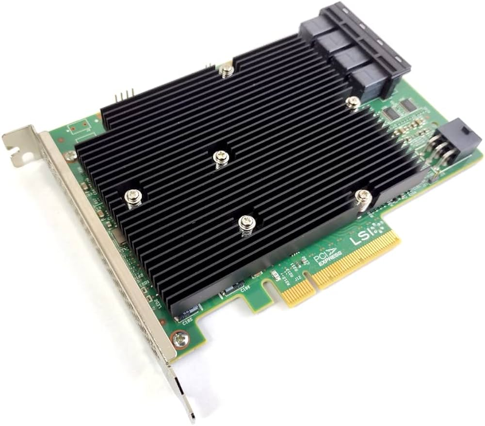
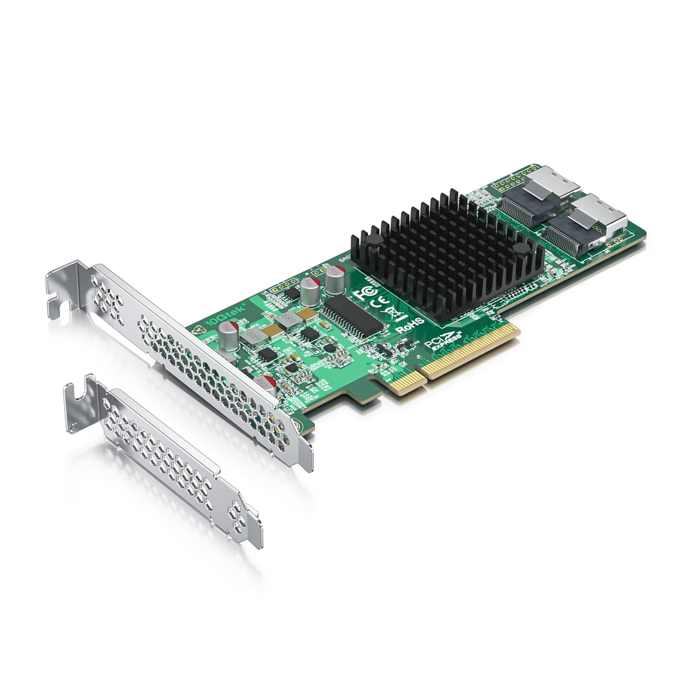
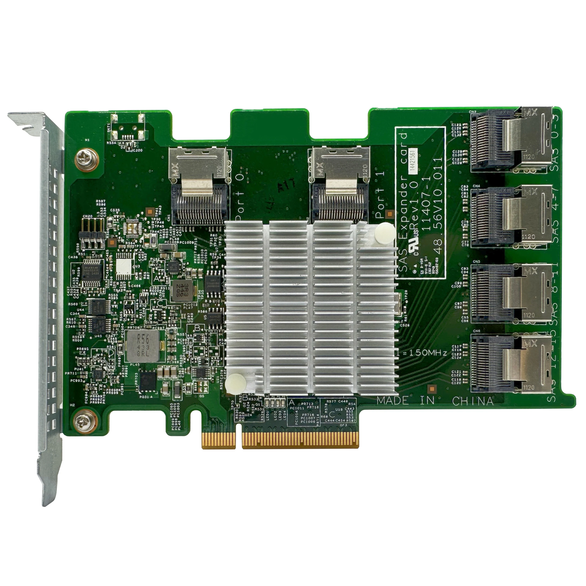
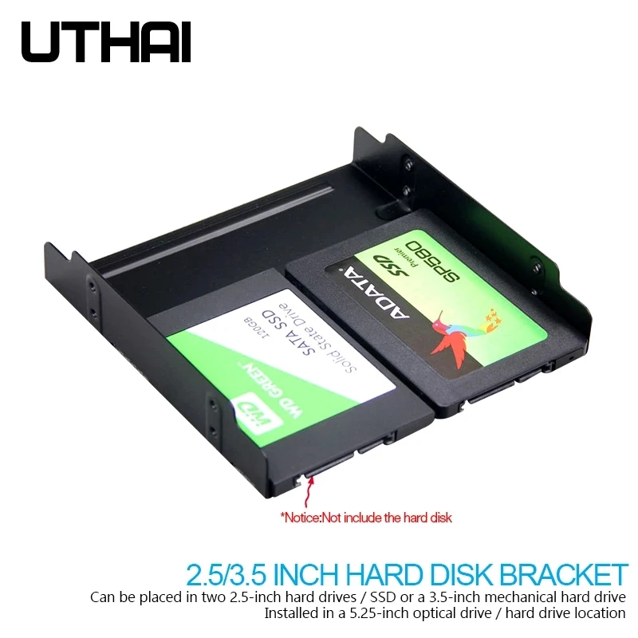
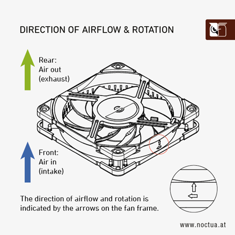
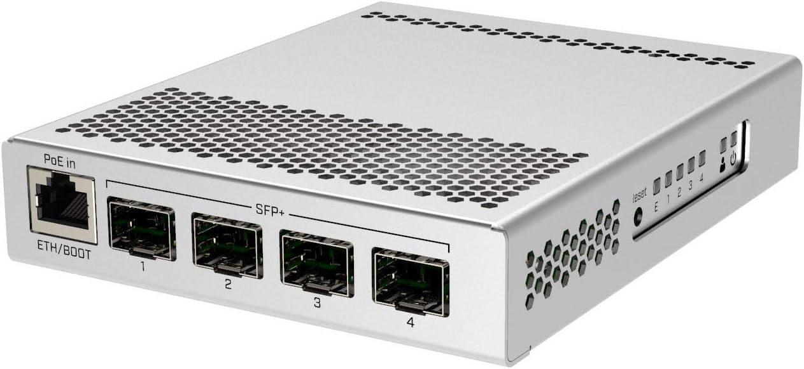
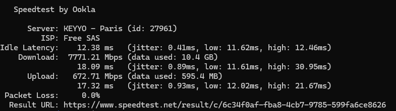

# Matériel

Nous avons essayé de trouver un bon compromis budget (~**500€**) / performance / consommation électrique.

|                      | Modèle                                  | Prix |                                                        |
|----------------------|-----------------------------------------|-----:|--------------------------------------------------------|
| **Processeur**           | AMD Athlon 220GE                  |  ~50€ | Faible consommation et suffisamment récent                          |
| **Carte mère**           | Gigabyte B450 Aorus Elite V2            | 110€ | Pas toujours évident à trouver                         |
| **Alimentation**         | Be Quiet! Pure Power 11 - 500W - Gold   |  80€ |                                                        |
| **HBA**                  | [LSI SAS 9300-16i](https://fr.aliexpress.com/item/1005005203882356.html)             |  63€ | Pour brancher 16 disques en SAS 3                              |
| **HBA**                  | [LSI SAS 9211-8i](https://fr.aliexpress.com/item/1005005028899772.html)             |  26€ | Pour brancher 8 disques en SAS 2                              |
| **RAM**                  | Corsair Vengeance LPX 3600 MHz par 16Go |  37€ | 8 gigs peuvent suffire même pour Plex                  |
| **NVMe**                 | Crucial 500Go                           |  35€ |                                                        |
| **Boîtier**                 | ATX minimum                      |  ~60€ | Privilégier un bon espace de fixation SSD/HDD et des emplacements pour la ventilation        |
| **Splitters d'alim**     | [Aliex SATA 1 -> 3](https://fr.aliexpress.com/item/1005007423555168.html)                       |   2€ | SATA mieux que Molex                                   |
| **Câbles de données**    | [Aliex **SFF 8643** -> **SFF 8482**](https://fr.aliexpress.com/item/1005004937995975.html)              |   8€ | Par câble pour 4 disques                               |
| **Ventilateur CPU**      | [Aliex AMD EOM](https://fr.aliexpress.com/item/1005005228000756.html)                           |  13€ | Low profile, le 220GE chauffe très peu                 |
| **Adaptateur disque**    | [Aliex 5.25" -> 3.5"-> 2.5"](https://www.aliexpress.com/item/4000087318148.html)              |   7€ | Pour baie 5.25"                                        |
| **Ventilos 12cm**         | [Younuon 4 pin PWM](https://fr.aliexpress.com/item/4000561653138.html)                       |   9€ | Semblent bruyants, à comparer avec Noctua                |
| **Rivets ventilos**      | [Aliex caoutchouc \*20](https://fr.aliexpress.com/item/1005002787135032.html)                    |   3€ |                                                        |
| **Chassis pour ventilo** | [Aliex adaptateur sur slot](https://fr.aliexpress.com/item/1005005868217402.html)               |   3€ | Pour ventiler le HBA                                   |
| **Splitter de ventilo**  | [Aliex 1 -> 2](https://fr.aliexpress.com/item/1005004621361878.html)                            |   1€ | La carte mère n'a que 4 connecteurs dont 1 pour le CPU |
| **Carte réseau 10Gb**  | [Aliex Intel X520](https://fr.aliexpress.com/item/1005005503868174.html)                            |   35€ |  |
| **Câble DAC**  | [Aliex 3 mètres](https://fr.aliexpress.com/item/1005006118860005.html)                            |   13€ |  |

La consommation électrique mesurée avec le matériel ci-dessus (4 ventilateurs 12") est de
- **50W** sans disque
- **80W** avec **8 SSD** (~160€ par an)
- **115W** avec **8 HDD** (~230€ par an)
- **120W** avec **16 SSD** (~240€ par an)

_À hauteur de 0.2276€ du kWh (EDF 2024) pour un fonctionnement 24/24_

Nous constatons une consommation moyenne d'environ **8W** par HDD et **4W** par SSD

# Le contrôleur SAS: HBA

Le HBA est le contrôleur qui permet à la carte mère de communiquer en SAS. Les cartes mères grand public ne gèrent que le SATA par défaut.

Le nom de code de la carte est en général de cette forme: **9XYY-Zi**

- **X** est la version du SAS: 2, 3, 4, ...
- **YY** est la révision du modèle
- **Z** est le nombre de disques connectables: 4, 8, 16, ...

Exemples:

- **9300-16i** SAS**3**, **première** révision, **16** disques (4 connecteurs "mini SAS")
- **9217-8i** SAS**2**, révision **17**, **8** disques (2 connecteurs)

Attention ces cartes peuvent atteindre \~80° sans ventilation. Il y a plusieurs façon de les ventiler, la plus simple étant d'y mettre un 12cm dédié avec un adaptateur slot (50° ventilée). Cette carte est censé supporter jusqu'à 110° mais il est fortement déconseillé de l'utiliser trop longtemps à haute température, sa durée de vie en serait réduite.

## SAS 3

Le SAS 3 permet théoriquement d'atteindre **12Gb/s**

Exemple de HBA SAS 3: **LSI SAS 9300-16i**



Cette carte possède 4 connecteurs mini SAS (**SFF 8643**) qui permettent de brancher 4 disques chacun, donc 16 disques (comme l'indique le `16i` du modèle)

## SAS 2

Le SAS 2 permet théoriquement d'atteindre **6Gb/s**

Exemple de HBA SAS 2: **LSI SAS 9211-8i**



Sur cette carte on peut voir 2 connecteurs **SFF-8087** qui est l'ancien format du mini SAS mais encore très répandu à priori. Donc ici il est possible de brancher 8 disques.

## Expander

Il est aussi possible d'étendre le nombre de connecteurs avec une carte dédiée.  

Exemple de SAS expander



Ici, les 2 connecteurs du haut Port 0 et Port 1 sont des entrées (à brancher sur des sorties du HBA), une seule peut suffire mais il faut s'assurer que le débit est suffisant.

Il faut savoir que les SAS expanders n'utilisent le slot PCIe que pour l'alimentation, les données transitent par le HBA avant d'arriver sur les ports d'entrée.

# Alimentation des disques

Les disques SAS implémentent une fonctionnalité appellée **Power Disable** qui permet d'éteindre un disque physiquement dans le but de le sortir de son emplacement par exemple (pour les machines 19" d'entreprise).

Pour éteindre le disque, il suffit d'**alimenter le pin 3** du connecteur SATA.

Certaines alimentations grand public n'ont pas connaissance de cette fonctionnalité et alimentent systématiquement le pin 3, ce qui **empéche les disques de démarrer**.

Dans ce cas, une solution simple est de passer par un adaptateur **Molex** car il n'alimente pas le pin 3.


Néanmoins le Molex est [déconseillé](https://www.crucial.com/support/articles-faq-ssd/dangerous-molex-to-sata-cables) car il peut **endommager les disques** voir **prendre feu** dans le pire des cas.

Il est conseillé d'avoir une alimentation suffisamment récente et des **répartiteurs SATA**


# Fixation des disques

À défaut de disposer d'une cage avec fond de panier ([backplane](https://www.monsieurcyberman.com/fr/95-backplane-serveur)) comme dans les machines 19" d'entreprise, l'idéal est de les fixer dans la facade pour pouvoir les ventiler plus facilement (surtout pour les SSD qui chauffent plus)



Cette platine 5.25" permet de visser 2 ou 4 SSD (je préfère me limiter à 2 pour permettre aux disques de respirer) ou un HDD au milieu

Il existe aussi ce type de cages:


# Raid

Il est possible de faire du Raid classique ou du RaidZ

⚠️ Considérations avec les disques d'entreprise

Ces disques sont souvent formatés par blocs de 520 octets, un Linux standard ne les lit pas, il faut donc les passer en 512 octets par bloc.

```bash
sudo sg_format --format --size=512 -Q /dev/sdX
```

Si `sg_format` n'existe pas, installer les packages requis:

```bash
sudo apt install sg3-utils
```

Compter environ
- **30s** pour un **SSD de 1.5To**
- **8h** pour un **HDD de 4To**.

Il est possible de **formater tous les disques en parallèle**. Pour ce faire **tmux** peut s'avérer utile car il peut lancer des shells indépendants du terminal d'origine (ce qui permet par exemple de lancer tous les formatages en SSH, de se déconnecter, et de revenir en surveiller la progression par la suite)

```bash
sudo apt install tmux
```

Lancer `tmux`

```bash
tmux
```

- <kbd>Ctrl</kbd> + <kbd>b</kbd> puis <kbd>c</kbd> pour créer un nouveau terminal
- <kbd>Ctrl</kbd> + <kbd>b</kbd> puis <kbd>n</kbd> pour basculer sur le terminal suivant


## RaidZ

Plus d'informations [ici](https://resinfo-gt.pages.in2p3.fr/zfs/doc/index.html)

- Installer les outils

```bash
$ sudo apt install zfsutils-linux
```

- Nommer les disques (pour éviter d'utiliser la forme `sdx` qui peut changer et pouvoir les retrouver plus facilement dans le boitier)

```bash
$ nano /etc/zfs/vdev_id.conf
```

```bash
alias SSD11 scsi-SNETAPP_X439_PHM23T0MCTO_75P0A056G32B
alias SSD12 scsi-SNETAPP_X439_PHM23T0MCTO_85D0A00IG32B
alias SSD13 scsi-SNETAPP_X439_PHM23T0MCTO_85D0A00NG32B
alias SSD14 scsi-SNETAPP_X439_PHM23T0MCTO_65L0A00BG32B
alias SSD21 scsi-SNETAPP_X439_PHM23T0MCTO_85F0A04FG32B
alias SSD22 scsi-SNETAPP_X439_PHM23T0MCTO_65M0A040G32B
alias SSD23 scsi-SNETAPP_X439_PHM23T0MCTO_65L0A00FG32B
alias SSD24 scsi-SNETAPP_X439_PHM23T0MCTO_75P0A01BG32B
alias SSD31 scsi-SNETAPP_X439_PHM23T0MCTO_Y5M0A034G32B
alias SSD32 scsi-SNETAPP_X439_PHM23T0MCTO_65L0A01DG32B
alias SSD33 scsi-SNETAPP_X439_PHM23T0MCTO_65L0A02DG32B
alias SSD34 scsi-SNETAPP_X439_PHM23T0MCTO_X5O0A03TG32B
alias SSD41 scsi-SNETAPP_X439_PHM23T0MCTO_7580A071G32B
alias SSD42 scsi-SNETAPP_X439_PHM23T0MCTO_85F0A03UG32B
alias SSD43 scsi-SNETAPP_X439_PHM23T0MCTO_65M0A020G32B
alias SSD44 scsi-SNETAPP_X439_PHM23T0MCTO_85D0A01PG32B
```

Ici les disques ont été nommés sous la forme SSD**XY**
- **X** étant le connecteur mini SAS du HBA
- **Y** le connecteur **SFF-8482** en général identifié avec une étiquette


- Prendre en compte nos vdevs renommés

```bash
sudo udevadm trigger
```

- Créer les volumes

```bash
sudo zpool create volume1 raidz SSD41 SSD42 SSD43 SSD44 SSD33 SSD34
sudo zpool create volume2 raidz SSD11 SSD12 SSD13 SSD14 SSD21 SSD22 SSD23 SSD24 SSD31 SSD32
```

- Les volumes sont maintenant visibles et utilisables dans `/volume1` & `/volume2`

### Replacer un disque

Si la commande suivante affiche un disque en erreur

```
zpool status
```

Exemple

```
  pool: volume1
 state: DEGRADED
status: One or more devices are faulted in response to persistent errors.
        Sufficient replicas exist for the pool to continue functioning in a
        degraded state.
action: Replace the faulted device or use 'zpool clear' to mark the device
        repaired.
   see: https://openzfs.github.io/openzfs-docs/msg/ZFS-8000-4J
  scan: resilvered 80.1M in 00:00:01 with 0 errors on Fri May 24 14:55:33 2024
config:

    NAME                     STATE     READ WRITE CKSUM
    volume1                  DEGRADED     0     0     0
      raidz1-0               DEGRADED     0     0     0
        SSD41                ONLINE       0     0     0
        SSD42                ONLINE       0     0     0
        SSD43                ONLINE       0     0     0
        SSD44                FAULTED      0    32     0  too many errors
        SSD33                ONLINE       0     0     0
        SSD34                ONLINE       0     0     0
```

- Éteindre la machine (sauf si racks avec backplane auquel cas il faut couper le disque avec `zpool offline`)
- Remplacer physiquement le disque
- Allumer la machine
- Repérer l'identifiant du nouveau disque en fouillant dans `/dev/disk/by-id` et en comparant avec les disques présents dans `/etc/zfs/vdev_id.conf`
- Remplacer le disque dans `/etc/zfs/vdev_id.conf`
- Faire prendre en comptes les modification
```
sudo udevadm trigger
```
- Réaffecter le disque
```
sudo zpool replace volume1 SSD44
```
- Il sera alors possible de suivre la progression du "resilvering"
```
sudo zpool status volume1
```

Exemple

```
  pool: volume1
 state: DEGRADED
status: One or more devices is currently being resilvered.  The pool will
	continue to function, possibly in a degraded state.
action: Wait for the resilver to complete.
  scan: resilver in progress since Mon Jan 13 08:18:45 2025
	1.69T / 2.35T scanned at 4.58G/s, 65.4G / 2.35T issued at 177M/s
	10.9G resilvered, 2.72% done, 03:46:20 to go
config:

	NAME                        STATE     READ WRITE CKSUM
	volume1                     DEGRADED     0     0     0
	  raidz1-0                  DEGRADED     0     0     0
	    replacing-0             DEGRADED     0     0     0
	      16695833288387324482  UNAVAIL      0     0     0  was /dev/disk/by-vdev/SSD41-part1/old
	      SSD41                 ONLINE       0     0     0  (resilvering)
	    SSD42                   ONLINE       0     0     0
	    SSD43                   ONLINE       0     0     0
	    SSD44                   ONLINE       0     0     0
	    SSD33                   ONLINE       0     0     0
	    SSD34                   ONLINE       0     0     0
```

## Raid classique

- Vérifier les noms des disques à utiliser dans le raid

```bash
ll /dev | grep sd
```

Exemple

```bash
ll /dev | grep sd
brw-rw----  1 root disk      8,    16 Jun 23 12:51 sdb
brw-rw----  1 root disk      8,    32 Jun 23 12:51 sdc
brw-rw----  1 root disk      8,    48 Jun 23 12:51 sdd
```

Ou plus précisément en utilisant `lsblk`

Exemple

```bash
osboxes@osboxes:~$ sudo lsblk
NAME                      MAJ:MIN RM  SIZE RO TYPE MOUNTPOINTS
sda                         8:0    0  500G  0 disk
├─sda1                      8:1    0    1M  0 part
├─sda2                      8:2    0    2G  0 part /boot
└─sda3                      8:3    0  498G  0 part
  └─ubuntu--vg-ubuntu--lv 252:0    0  100G  0 lvm  /
sdb                         8:16   0    2G  0 disk
sdc                         8:32   0    2G  0 disk
sdd                         8:48   0    2G  0 disk
sr0                        11:0    1 1024M  0 rom
```

- Créer le raid

```bash
sudo mdadm --create --verbose /dev/md0 --level=5 --raid-devices=3 /dev/sdb /dev/sdc /dev/sdd
```

- Formater le raid en ext4

```bash
sudo mkfs.ext4 /dev/md0
```

Créer le répertoire où le raid sera monté

```bash
sudo mkdir -p /media/volume
```

Il est possible de monter le raid directement ou le faire monter automatiquement au démarrage en modifiant le fstab

```bash
mount /dev/md0 /media/volume
```

Pour le fstab, ajouter la ligne suivante dans `/etc/fstab`

```bash
sudo nano /etc/fstab

/dev/md0 /media/volume ext4 nofail 0 0
```

Noter le "nofail" en 4ème colonne, cette option est utile, car si le raid est cassé, au démarrage du server la partion zobbée qui ne sera donc pas montée, n'empêchera pas le système de booter.

### Dépannage

Il est possible de vérifier l'état du raid avec cette commande mdadm

```bash
osboxes@osboxes:/media$ sudo mdadm --detail /dev/md0
/dev/md0:
           Version : 1.2
     Creation Time : Sun Jun 30 12:14:04 2024
        Raid Level : raid5
        Array Size : 4188160 (3.99 GiB 4.29 GB)
     Used Dev Size : 2094080 (2045.00 MiB 2144.34 MB)
      Raid Devices : 3
     Total Devices : 3
       Persistence : Superblock is persistent

       Update Time : Sun Jun 30 12:16:40 2024
             State : clean
    Active Devices : 3
   Working Devices : 3
    Failed Devices : 0
     Spare Devices : 0

            Layout : left-symmetric
        Chunk Size : 512K

Consistency Policy : resync

              Name : osboxes:0  (local to host osboxes)
              UUID : 0726cf1c:276d6360:4423d128:8fbd9d0b
            Events : 18

    Number   Major   Minor   RaidDevice State
       0       8       16        0      active sync   /dev/sdb
       1       8       32        1      active sync   /dev/sdc
       3       8       48        2      active sync   /dev/sdd
```

Si un disque part en zob le raid passera en "degraded", nous verrons le disque foiré qui sera indiqué "removed"

```bash
osboxes@osboxes:/media$ sudo mdadm --detail /dev/md0
/dev/md0:
           Version : 1.2
     Creation Time : Sun Jun 30 12:14:04 2024
        Raid Level : raid5
        Array Size : 4188160 (3.99 GiB 4.29 GB)
     Used Dev Size : 2094080 (2045.00 MiB 2144.34 MB)
      Raid Devices : 3
     Total Devices : 3
       Persistence : Superblock is persistent

       Update Time : Sun Jun 30 12:16:40 2024
             State : clean, degraded
    Active Devices : 3
   Working Devices : 3
    Failed Devices : 0
     Spare Devices : 0

            Layout : left-symmetric
        Chunk Size : 512K

Consistency Policy : resync

              Name : osboxes:0  (local to host osboxes)
              UUID : 0726cf1c:276d6360:4423d128:8fbd9d0b
            Events : 18

    Number   Major   Minor   RaidDevice State
       0       8       16        0      active sync   /dev/sdb
       1       8       32        1      active sync   /dev/sdc
       3       8       48        2      removed
```

Détecter le disque cassé:

```bash
cat /proc/mdstat
Personalities : [linear] [multipath] [raid0] [raid1] [raid5] [raid4] [raid6] [raid10]
md0 : active raid1 sdc[1] sdb[0] sdd[2](F)
      976773168 blocks [2/1] [U_]
```	  

Ici on voit que le `sdd` est taggé en Faulty (F).

Retirer le disque du raid:

```bash
mdadm --manage /dev/md0 --remove /dev/sdd
```

Remplacer le disque physiquement

Copier la table de partition sur le nouveau disque:

```bash
sfdisk -d /dev/sda | sfdisk /dev/sdd
```

Ajouter le disque à votre array en vérifiant la lettre du volume avant `sdX`:

```bash
mdadm --manage /dev/md0 --add /dev/sdX
```

Verifier l'état du Raid:

```bash
sudo mdadm --detail /dev/md0
```

## Températures

Depuis un terminal il est possible de voir les températures de toutes les sondes (HBA, disques, processeur, NVMe, etc.)

### HBA

Si le HBA est un LSI il faut installer l'outil Storcli de Broadcom:

- Récupérer l'archive qui contient tous les builds depuis [le site de Broadcom](https://docs.broadcom.com/docs/1232743501) (accepter les conditions)
- Localiser le package correspondant à la distrib Linux
- Installer le package (ici pour Ubuntu)
```
sudo dpkg -i ./storcli_007.2707.0000.0000_all.deb
```
- L'exécutable sera installé dans `/opt/MegaRAID/storcli/storcli64`
- Utiliser l'exécutable
```
sudo /opt/MegaRAID/storcli/storcli64 /c0 show temperature
```
`/c0` correspond au premier HBA, attention le **9300-16i** contient 2 modules (1 pour 2 connecteurs SAS) et donc 2 sondes de température
- Pour voir le 2ème
```
sudo /opt/MegaRAID/storcli/storcli64 /c1 show temperature
```

Exemple:

```
$ sudo /opt/MegaRAID/storcli/storcli64 /c0 show temperature | grep temp

ROC temperature(Degree Celsius) 51
```
_Le premier module est ici à 51°_

### Disques

La récupération des détails des disques peut se faire avec le package `smartmontools`

- Installer `smartmontools`
```
sudo apt install smartmontools
```
- Lire les détails sur un \<disque\>
```
sudo smartctl -A /dev/disk/by-vdev/<disque>
```
- Récupérer la température actuelle
```
sudo smartctl -A /dev/disk/by-vdev/<disque> | grep "Drive Temp"
```

Exemple:

```
$ sudo smartctl -A /dev/disk/by-vdev/SSD11

Current Drive Temperature:     32 C
```

Exemple de script shell pour récupérer les températures de 16 disques nommés `SSD<XY>`

```sh
#!/bin/bash
for y in 1 2 3 4
do
    for x in 1 2 3 4
    do
#        smartctl -a /dev/disk/by-vdev/SSD$x$y
         temp=`smartctl -A /dev/disk/by-vdev/SSD$x$y | grep "Drive Temp" | sed -n "s/^.*\:\s*//p" | sed -n "s/ C$//p"`
         echo -n "SSD$x$y: $temp°   "
         [ "$x" = "4" ] && echo ""
    done
done
```

Résultat:

```
SSD11: 33°   SSD21: 29°   SSD31: 32°   SSD41: 32°   
SSD12: 32°   SSD22: 31°   SSD32: 27°   SSD42: 29°   
SSD13: 30°   SSD23: 30°   SSD33: 26°   SSD43: 28°   
SSD14: 29°   SSD24: 29°   SSD34: 27°   SSD44: 27°   
```

### Autres composants

Les autres composants peuvent être vérifiés à l'aide `lm-sensors`

- Installer `lm-sensors`

```
sudo apt install lm-sensors
```

- Lancer la détection des composants

```
sudo sensors-detect
```

- Laisser les réponses par défaut
- Répondre seulement **yes** à la question

> Do you want to add these lines automatically to /etc/modules?

- Lire les résultats

```
sensors
```

Exemple:

```
$ sensors

amdgpu-pci-0c00
Adapter: PCI adapter
vddgfx:           N/A  
vddnb:            N/A  
edge:         +26.0°C  

it8792-isa-0a60
Adapter: ISA adapter
in0:           1.79 V  (min =  +0.00 V, max =  +2.78 V)
in1:           1.30 V  (min =  +0.00 V, max =  +2.78 V)
in2:           1.19 V  (min =  +0.00 V, max =  +2.78 V)
+3.3V:         3.36 V  (min =  +0.00 V, max =  +5.56 V)
in4:           1.27 V  (min =  +0.00 V, max =  +2.78 V)
in5:           1.15 V  (min =  +0.00 V, max =  +2.78 V)
in6:           2.78 V  (min =  +0.00 V, max =  +2.78 V)  ALARM
3VSB:          3.33 V  (min =  +0.00 V, max =  +5.56 V)
Vbat:          3.10 V  
fan1:           0 RPM  (min =    0 RPM)
fan2:           0 RPM  (min =    0 RPM)
fan3:           0 RPM  (min =    0 RPM)
temp1:        +29.0°C  (low  = +127.0°C, high = +127.0°C)  sensor = thermistor
temp2:        +36.0°C  (low  = +127.0°C, high = +127.0°C)  sensor = thermistor
temp3:        +35.0°C  (low  = +127.0°C, high = +127.0°C)  sensor = thermistor
intrusion0:  ALARM

acpitz-acpi-0
Adapter: ACPI interface
temp1:        +16.8°C  

k10temp-pci-00c3
Adapter: PCI adapter
Tctl:         +26.4°C  

nvme-pci-0b00
Adapter: PCI adapter
Composite:    +34.9°C  (low  =  -0.1°C, high = +84.8°C)
                       (crit = +94.8°C)
Sensor 1:     +34.9°C  (low  = -273.1°C, high = +65261.8°C)
Sensor 2:     +40.9°C  (low  = -273.1°C, high = +65261.8°C)
Sensor 8:     +34.9°C  (low  = -273.1°C, high = +65261.8°C)
```

# Ventilation

En général, il est conseillé de faire entrer l'air par l'avant sur les disques et de le faire sortir à l'arrière et/ou vers le haut


Attention à l'orientation des ventilos, on peut la voir en général en relief



Pour ventiler le HBA, il est possible d'utiliser ce type d'adaptateur qui se fixe sur un slot du boitier (au niveau des PCI):


Avec cet adaptateur, il est possible de chainer deux ventilateurs côte à côte.

## PWM

La gestion de la vitesse des ventilateurs est normalement possible avec `pwmconfig` (qui est installé avec `lm-sensors` mentionné dans les [Autres composants](#autres-composants))

Mais je n'ai pas réussi à récupérer quoique ce soit avec la carte mère **B450 Aorus Elite V2**

# Réseau

Le **SAS 3** permet un débit théorique de 1Go/s. En pratique, j'ai pu atteindre **500Mo/s** en écriture sur un SSD SAS 3 (simple rsync d'un gros fichier et sans raid).

Avec la bonne boite internet (exemple Delta ou Ultra de chez Free), il suffit donc d'avoir une **carte réseau 10Gb** avec le bon câble pour permettre une vitesse de téléchargement élevée.

## Interface

En termes d'interface, il existe des **cartes SFP+** à 35€ sur Aliexpress (exemple en lien dans le tableau du matériel)


Attention ces interfaces grand public **ne gèrent pas le WOL**, j'ai personnellement laissé l'ethernet 1Gb intégré à la carte mère branché pour garder cette fonctionnalité.

## Câbles

Si la machine n'est pas trop éloignée du routeur (pas plus de **10m**) l'idéal est d'utiliser un **câble DAC**. Il a l'avantage de moins faire consommer et moins chauffer les interfaces. Sinon il faut passer sur de la fibre qui requiert des modules de chaque côté pour convertir le signal électrique en lumière et inversement.

Ici un DAC sur Aliexpress (3m → **13€**)


## Souiche

Si besoin de brancher plusieurs appareils en SFP+, le switch **Mikrotik CRS305** est un bon compromi et coute environ 140€ sur Amazon.



Le Mikrotik CRS305 possède 4 ports SFP+ et 1 PoE

Test de débit avec Speedtest en utilisant le matériel en question (et une boite Delta de chez Free)


