Le but est de trouver les solutions pour créer un serveur à partir de zero autour de disques SAS.

Nous avons essayé de trouver un bon compromis budget (~**500€**) / performance / consommation électrique.

# Matériel

|                      | Modèle                                  | Prix |                                                        |
|----------------------|-----------------------------------------|-----:|--------------------------------------------------------|
| **Processeur**           | AMD Athlon 220GE                  |  ~50€ | Faible consommation et suffisamment récent                          |
| **Carte mère**           | Gigabyte B450 Aorus Elite V2            | 110€ | Pas toujours évident à trouver                         |
| **Alimentation**         | Be Quiet! Pure Power 11 - 500W - Gold   |  80€ |                                                        |
| **HBA**                  | [LSI SAS 9300-16i](https://fr.aliexpress.com/item/1005005203882356.html)             |  63€ | Pour brancher 16 disques en SAS 3                              |
| **HBA**                  | [LSI SAS 9211-8i](https://fr.aliexpress.com/item/1005005028899772.html)             |  26€ | Pour brancher 8 disques en SAS 2                              |
| **RAM**                  | Corsair Vengeance LPX 3600 MHz par 16Go |  37€ | 8 gigs peuvent suffire même pour Plex                  |
| **NVMe**                 | Crucial 500Go                           |  35€ |                                                        |
| **Boîtier**                 | ATX minimum                      |  ~60€ | Privilégier un bon espace de fixation SSD/HDD et des emplacements pour la ventilation        |
| **Splitters d'alim**     | [Aliex SATA 1 -> 3](https://fr.aliexpress.com/item/1005005766877776.html)                       |   2€ | SATA mieux que Molex                                   |
| **Câbles de données**    | [Aliex **SFF 8643** -> **SFF 8482**](https://fr.aliexpress.com/item/1005004937995975.html)              |   8€ | Par câble pour 4 disques                               |
| **Ventilateur CPU**      | [Aliex AMD EOM](https://fr.aliexpress.com/item/1005005228000756.html)                           |  13€ | Low profile, le 220GE chauffe très peu                 |
| **Adaptateur disque**    | [Aliex 5.25" -> 3.5"-> 2.5"](https://www.aliexpress.com/item/4000087318148.html)              |   7€ | Pour baie 5.25"                                        |
| **Ventilos 12cm**         | [Younuon 4 pin PWM](https://fr.aliexpress.com/item/4000561653138.html)                       |   9€ | Semblent bruyants, comparer avec Noctua                |
| **Rivets ventilos**      | [Aliex caoutchouc \*20](https://fr.aliexpress.com/item/1005002787135032.html)                    |   3€ |                                                        |
| **Chassis pour ventilo** | [Aliex adaptateur sur slot](https://fr.aliexpress.com/item/1005005868217402.html)               |   3€ | Pour ventiler le HBA                                   |
| **Splitter de ventilo**  | [Aliex 1 -> 2](https://fr.aliexpress.com/item/1005004621361878.html)                            |   1€ | La carte mère n'a que 4 connecteurs dont 1 pour le CPU |
| **Carte réseau 10Gb**  | [Aliex Intel X520](https://fr.aliexpress.com/item/1005005503868174.html)                            |   35€ |  |
| **Câble DAC**  | [Aliex 3 mètres](https://fr.aliexpress.com/item/1005006118860005.html)                            |   13€ |  |

La consommation électrique constatée avec le matériel ci-dessus (4 ventilateurs 12") est de **80W** avec **8 SSD**, **120W** avec **16 SSD**

# Le contrôleur SAS: HBA

Le HBA est le contrôleur qui permet à la carte mère de communiquer en SAS. Les cartes mères grand public ne gèrent que le SATA par défaut.

Le nom de code de la carte est en général de cette forme: **9XYY-Zi**

- **X** est la version du SAS: 2, 3, 4, ...
- **YY** est la révision du modèle
- **Z** est le nombre de disques connectables: 4, 8, 16, ...

Exemples:

- **9300-16i** SAS**3**, **première** révision, **16** disques (4 connecteurs "mini SAS")
- **9217-8i** SAS**2**, révision **17**, **8** disques (2 connecteurs)

Attention ces cartes peuvent atteindre \~80° sans ventilation. Il y a plusieurs façon de les ventiler, la plus simple étant d'y mettre un 12cm dédié avec un adaptateur slot (50° ventilée). Cette carte est censé supporter jusqu'à 110° mais il est fortement déconseillé de l'utiliser trop longtemps à haute température, sa durée de vie en serait réduite.

## SAS 3

Le SAS 3 permet théoriquement d'atteindre **12Gb/s**

Exemple de HBA SAS 3: **LSI SAS 9300-16i**

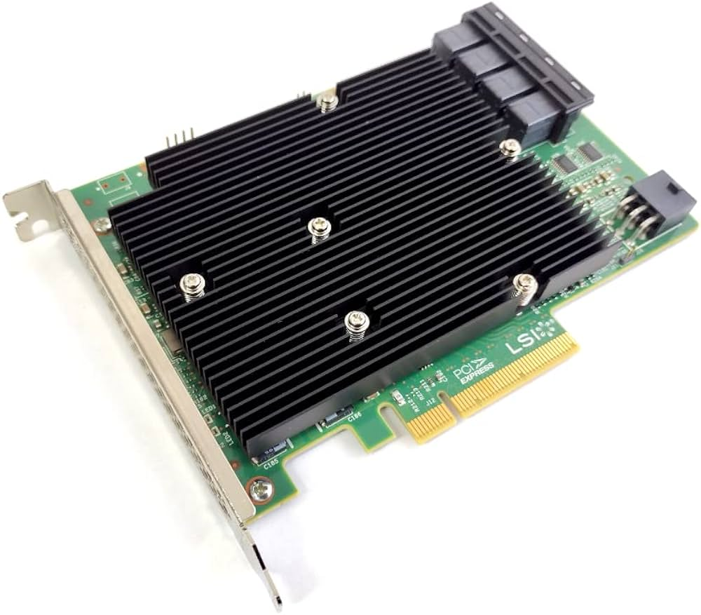

Cette carte possède 4 connecteurs mini SAS (**SFF 8643**) qui permettent de brancher 4 disques chacun, donc 16 disques (comme l'indique le `16i` du modèle)

## SAS 2

Le SAS 2 permet théoriquement d'atteindre **6Gb/s**

Exemple de HBA SAS 2: **LSI SAS 9211-8i**

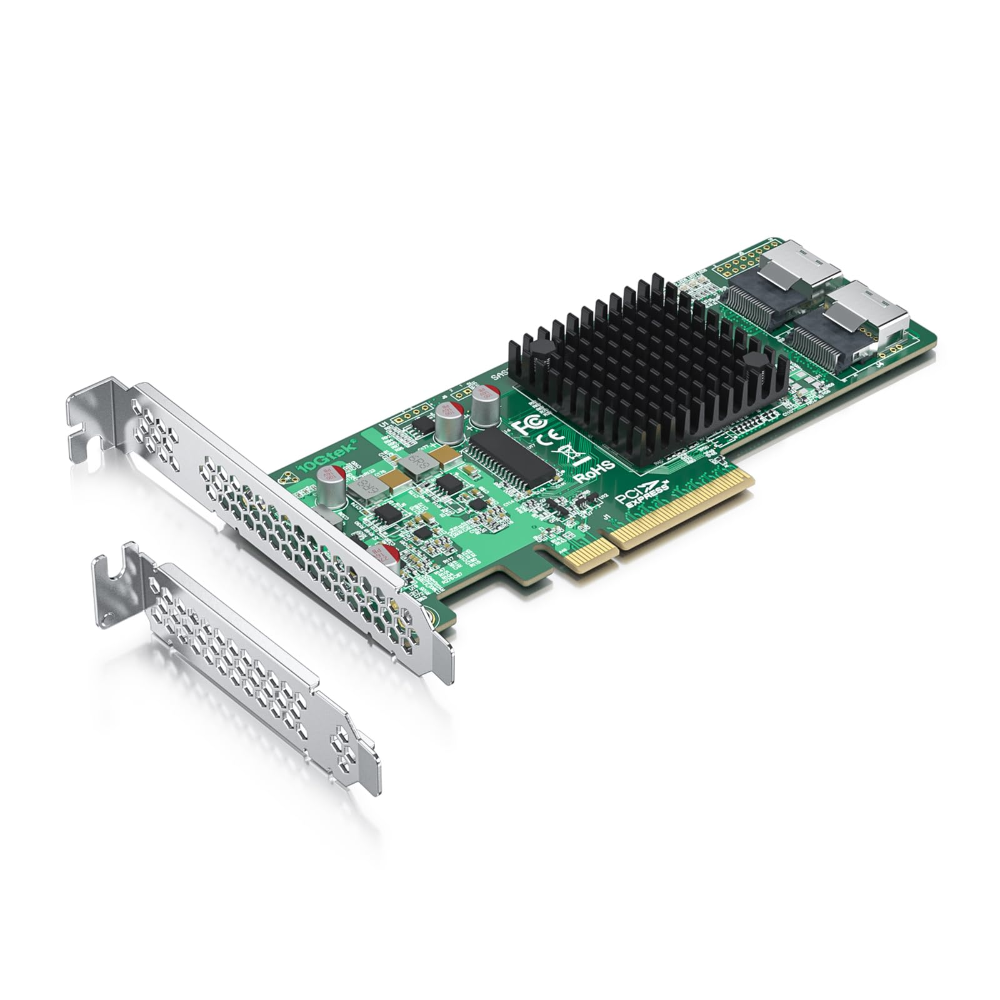

Sur cette carte on peut voir 2 connecteurs **SFF-8087** qui est l'ancien format du mini SAS mais encore très répandu à priori. Donc ici il est possible de brancher 8 disques.

## Expander

Il est aussi possible d'étendre le nombre de connecteurs avec une carte dédiée.  

Exemple de SAS expander

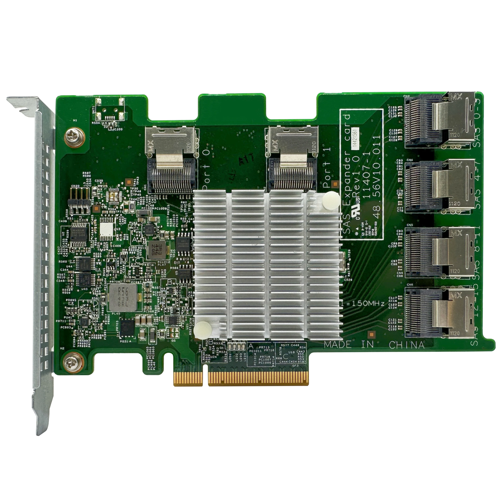

Ici, les 2 connecteurs du haut Port 0 et Port 1 sont des entrées (à brancher sur des sorties du HBA), une seule peut suffire mais il faut s'assurer que le débit est suffisant.

Il faut savoir que les SAS expanders n'utilisent le slot PCIe que pour l'alimentation, les données transitent par le HBA avant d'arriver sur les ports d'entrée.

# Fixation des disques

À défaut de disposer d'une cage avec fond de panier ([backplane](https://www.monsieurcyberman.com/fr/95-backplane-serveur)) comme dans les machines 19" d'entreprise, l'idéal est de les fixer dans la facade pour pouvoir les ventiler plus facilement (surtout pour les SSD qui chauffent plus)


Cette platine 5.25" permet de visser 2 ou 4 SSD (je préfère me limiter à 2 pour permettre aux disques de respirer) ou un HDD au milieu

Il existe aussi ce type de cages:

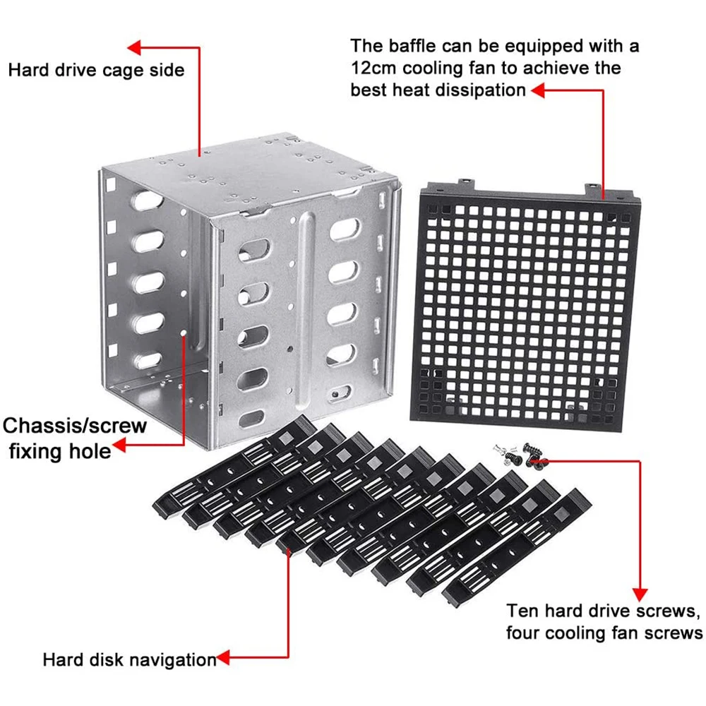

# Raid

Il est possible de faire du Raid classique ou du RaidZ

## Raid classique

Vérifiez les noms de vos disques en faisant:

Exemple Output:

```bash
ll /dev | grep sd
brw-rw----  1 root disk      8,     0 Jun 23 12:51 sda
brw-rw----  1 root disk      8,    16 Jun 23 12:51 sdb
brw-rw----  1 root disk      8,    32 Jun 23 12:51 sdc
brw-rw----  1 root disk      8,    48 Jun 23 12:51 sdd
brw-rw----  1 root disk      8,    64 Jun 23 12:51 sde
brw-rw----  1 root disk      8,    80 Jun 23 12:51 sdf
brw-rw----  1 root disk      8,    96 Jun 23 12:51 sdg
brw-rw----  1 root disk      8,   112 Jun 23 12:51 sdh
```

Créez le raid:

```bash
sudo mdadm --create --verbose /dev/md0 --level=5 --raid-devices=8 /dev/sda /dev/sdb /dev/sdc /dev/sdd /dev/sde /dev/sdf /dev/sdg /dev/sdh
```

Formatez votre raid en ext4:

```bash
sudo mdadm --create --verbose /dev/md0 --level=5 --raid-devices=8 /dev/sda /dev/sdb /dev/sdc /dev/sdd /dev/sde /dev/sdf /dev/sdg /dev/sdh
```

Créez le répertoire où vous voulez monter votre filesystem:

```bash
sudo mkdir -p /media/volume
```

Vous pouvez monter votre raid directement ou le faire monter automatiquement au démarrage en éditant votre fstab:

```bash
mount /dev/md0 /media/volume
```

Pour le fstab, ajouter la ligne suivante en root:

```bash
nano /etc/fstab
/dev/md0 /media/volume ext4 defaults 0 0
```

## RaidZ

Plus d'informations [ici](https://resinfo-gt.pages.in2p3.fr/zfs/doc/index.html)

- Installer les outils

```bash
$ sudo apt install zfsutils-linux
```

- Nommer les disques (pour éviter d'utiliser la forme `sdx` qui peut changer et pouvoir les retrouver plus facilement dans le boitier)

```bash
$ nano /etc/zfs/vdev_id.conf
```

```bash
alias SSD11 scsi-SNETAPP_X439_PHM23T0MCTO_75P0A056G32B
alias SSD12 scsi-SNETAPP_X439_PHM23T0MCTO_85D0A00IG32B
alias SSD13 scsi-SNETAPP_X439_PHM23T0MCTO_85D0A00NG32B
alias SSD14 scsi-SNETAPP_X439_PHM23T0MCTO_65L0A00BG32B
alias SSD21 scsi-SNETAPP_X439_PHM23T0MCTO_85F0A04FG32B
alias SSD22 scsi-SNETAPP_X439_PHM23T0MCTO_65M0A040G32B
alias SSD23 scsi-SNETAPP_X439_PHM23T0MCTO_65L0A00FG32B
alias SSD24 scsi-SNETAPP_X439_PHM23T0MCTO_75P0A01BG32B
alias SSD31 scsi-SNETAPP_X439_PHM23T0MCTO_Y5M0A034G32B
alias SSD32 scsi-SNETAPP_X439_PHM23T0MCTO_65L0A01DG32B
alias SSD33 scsi-SNETAPP_X439_PHM23T0MCTO_65L0A02DG32B
alias SSD34 scsi-SNETAPP_X439_PHM23T0MCTO_X5O0A03TG32B
alias SSD41 scsi-SNETAPP_X439_PHM23T0MCTO_7580A071G32B
alias SSD42 scsi-SNETAPP_X439_PHM23T0MCTO_85F0A03UG32B
alias SSD43 scsi-SNETAPP_X439_PHM23T0MCTO_65M0A020G32B
alias SSD44 scsi-SNETAPP_X439_PHM23T0MCTO_85D0A01PG32B
```

Ici les disques ont été nommés sous la forme SSD**XY**
- **X** étant le connecteur mini SAS du HBA
- **Y** le connecteur **SFF-8482** en général identifié avec une étiquette


- Prendre en compte nos vdevs renommés

```bash
sudo udevadm trigger
```

- Créer les volumes

```bash
sudo zpool create volume1 raidz SSD41 SSD42 SSD43 SSD44 SSD33 SSD34
sudo zpool create volume2 raidz SSD11 SSD12 SSD13 SSD14 SSD21 SSD22 SSD23 SSD24 SSD31 SSD32
```

- Les volumes sont maintenant visibles et utilisables dans `/volume1` & `/volume2`

## Températures

Depuis un terminal il est possible de voir les températures de toutes les sondes (HBA, disques, processeur, NVMe, etc.)

### HBA

Si le HBA est un LSI il faut installer l'outil Storcli de Broadcom:

- Récupérer l'archive qui contient tous les builds depuis [le site de Broadcom](https://docs.broadcom.com/docs/1232743501) (accepter les conditions)
- Localiser le package correspondant à la distrib Linux
- Installer le package (ici pour Ubuntu)
```
sudo dpkg -i ./storcli_007.2707.0000.0000_all.deb
```
- L'exécutable sera installé dans `/opt/MegaRAID/storcli/storcli64`
- Utiliser l'exécutable
```
sudo /opt/MegaRAID/storcli/storcli64 /c0 show temperature
```
`/c0` correspond au premier HBA, attention le **9300-16i** contient 2 modules (1 pour 2 connecteurs SAS) et donc 2 sondes de température
- Pour voir le 2ème
```
sudo /opt/MegaRAID/storcli/storcli64 /c1 show temperature
```

Exemple:

```
$ sudo /opt/MegaRAID/storcli/storcli64 /c0 show temperature | grep temp

ROC temperature(Degree Celsius) 51
```
_Le premier module est ici à 51°_

### Disques

La récupération des détails des disques peut se faire avec le package `smartmontools`

- Installer `smartmontools`
```
sudo apt install smartmontools
```
- Lire les détails sur un \<disque\>
```
sudo smartctl -A /dev/disk/by-vdev/<disque>
```
- Récupérer la température actuelle
```
sudo smartctl -A /dev/disk/by-vdev/<disque> | grep "Drive Temp"
```

Exemple:

```
$ sudo smartctl -A /dev/disk/by-vdev/SSD11

Current Drive Temperature:     32 C
```

Exemple de script shell pour récupérer les températures de 16 disques nommés `SSD<XY>`

```sh
#!/bin/bash
for y in 1 2 3 4
do
    for x in 1 2 3 4
    do
#        smartctl -a /dev/disk/by-vdev/SSD$x$y
         temp=`smartctl -A /dev/disk/by-vdev/SSD$x$y | grep "Drive Temp" | sed -n "s/^.*\:\s*//p" | sed -n "s/ C$//p"`
         echo -n "SSD$x$y: $temp°   "
         [ "$x" = "4" ] && echo ""
    done
done
```

Résultat:

```
SSD11: 33°   SSD21: 29°   SSD31: 32°   SSD41: 32°   
SSD12: 32°   SSD22: 31°   SSD32: 27°   SSD42: 29°   
SSD13: 30°   SSD23: 30°   SSD33: 26°   SSD43: 28°   
SSD14: 29°   SSD24: 29°   SSD34: 27°   SSD44: 27°   
```

### Autres composants

Les autres composants peuvent être vérifiés à l'aide `lm-sensors`

- Installer `lm-sensors`

```
sudo apt install lm-sensors
```

- Lancer la détection des composants

```
sudo sensors-detect
```

- Laisser les réponses par défaut
- Répondre seulement **yes** à la question

> Do you want to add these lines automatically to /etc/modules?

- Lire les résultats

```
sensors
```

Exemple:

```
$ sensors

amdgpu-pci-0c00
Adapter: PCI adapter
vddgfx:           N/A  
vddnb:            N/A  
edge:         +26.0°C  

it8792-isa-0a60
Adapter: ISA adapter
in0:           1.79 V  (min =  +0.00 V, max =  +2.78 V)
in1:           1.30 V  (min =  +0.00 V, max =  +2.78 V)
in2:           1.19 V  (min =  +0.00 V, max =  +2.78 V)
+3.3V:         3.36 V  (min =  +0.00 V, max =  +5.56 V)
in4:           1.27 V  (min =  +0.00 V, max =  +2.78 V)
in5:           1.15 V  (min =  +0.00 V, max =  +2.78 V)
in6:           2.78 V  (min =  +0.00 V, max =  +2.78 V)  ALARM
3VSB:          3.33 V  (min =  +0.00 V, max =  +5.56 V)
Vbat:          3.10 V  
fan1:           0 RPM  (min =    0 RPM)
fan2:           0 RPM  (min =    0 RPM)
fan3:           0 RPM  (min =    0 RPM)
temp1:        +29.0°C  (low  = +127.0°C, high = +127.0°C)  sensor = thermistor
temp2:        +36.0°C  (low  = +127.0°C, high = +127.0°C)  sensor = thermistor
temp3:        +35.0°C  (low  = +127.0°C, high = +127.0°C)  sensor = thermistor
intrusion0:  ALARM

acpitz-acpi-0
Adapter: ACPI interface
temp1:        +16.8°C  

k10temp-pci-00c3
Adapter: PCI adapter
Tctl:         +26.4°C  

nvme-pci-0b00
Adapter: PCI adapter
Composite:    +34.9°C  (low  =  -0.1°C, high = +84.8°C)
                       (crit = +94.8°C)
Sensor 1:     +34.9°C  (low  = -273.1°C, high = +65261.8°C)
Sensor 2:     +40.9°C  (low  = -273.1°C, high = +65261.8°C)
Sensor 8:     +34.9°C  (low  = -273.1°C, high = +65261.8°C)
```

# Ventilation

Faire entrer l'air par l'avant sur les disques et le faire sortir à l'arrière et/ou vers le haut

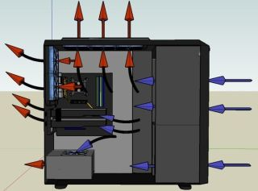

Attention à l'orientation des ventilos, on peut la voir en général en relief


Pour ventiler le HBA il est possible d'utiliser ce type d'adaptateur qui se fixe sur un slot du boitier (au niveau des PCI):


Avec cet adaptateur, il est possible de chainer 2 ventilateurs côte à côte.

## PWM

La gestion de la vitesse des ventilateurs est normalement possible avec `pwmconfig` (qui est installé avec `lm-sensors` mentionné dans les [Autres composants](#autres-composants))

Mais je n'ai pas réussi à récupérer quoique ce soit avec la carte mère **B450 Aorus Elite V2**

# Réseau

Le **SAS 3** permet un débit théorique de 1Go/s. En pratique j'ai pu atteindre **500Mo/s** en écriture sur un SSD SAS 3 (simple rsync d'un gros fichier et sans raid).

Avec la bonne boite internet (exemple Freebox Delta), il suffit donc d'avoir une **carte réseau 10Gb** avec le bon câble pour permettre une vitesse de téléchargement élevée.

## Interface

En termes d'interface, il existe des **cartes SFP+** à 35€ sur Aliexpress (exemple en lien dans le tableau du matériel)


Attention ces interfaces grand publique **ne gèrent pas le WOL**, j'ai personnellement laissé l'ethernet 1Gb intégré à la carte mère branché pour garder cette fonctionnalité.

## Câbles

Si la machine n'est pas trop éloignée du routeur (pas plus de **10m**) l'idéal est d'utiliser un **câble DAC**. Il a l'avantage de moins faire consommer et moins chauffer les interfaces. Sinon il faut passer sur de la fibre qui requiert des modules de chaque coté pour convertir le signal électrique en lumière et inversement.

Ici un DAC sur Aliexpress (3m -> **13€**)

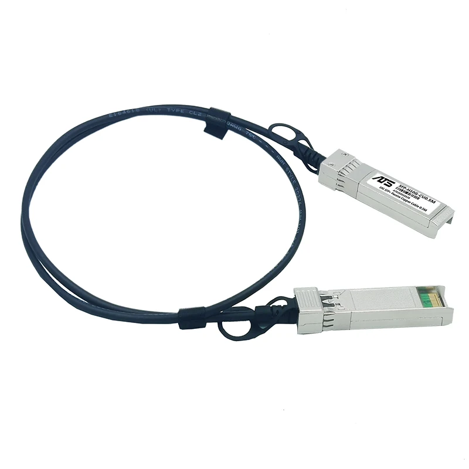

## Souiche

Si besoin de brancher plusieurs appareils en SFP+, le switch **Mikrotik CRS305** est un bon compromi et coute environ 140€ sur Amazon

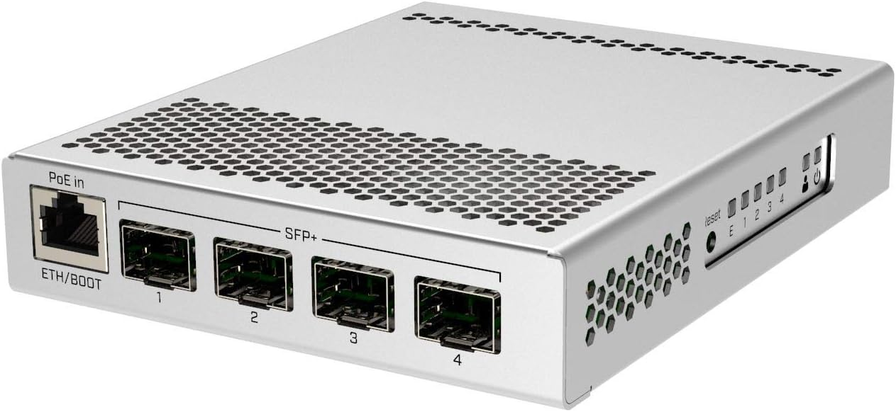

Le Mikrotik CRS305 possède 4 ports SFP+ et 1 PoE

Test de débit avec Speedtest en utilisant le matériel en question (et une boite Freebox Delta)

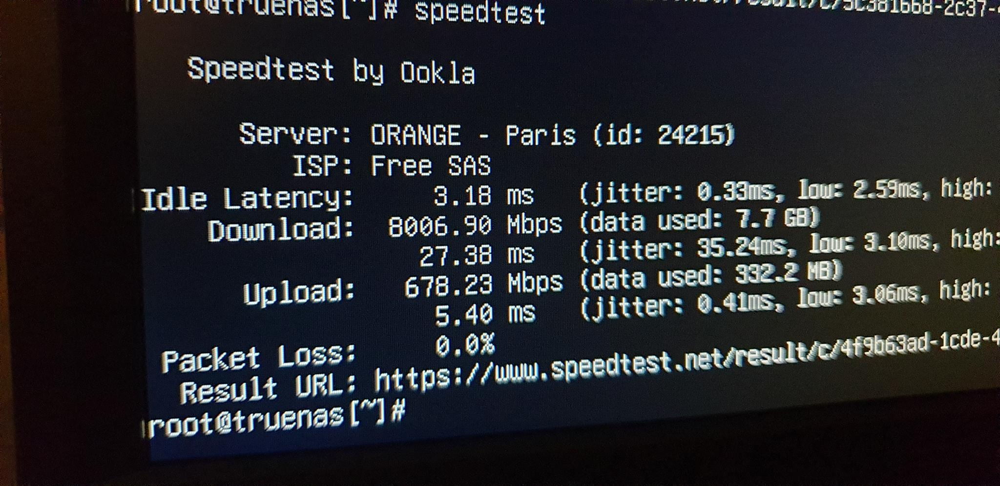

# Services

## Surveillance

Plusieurs choses sont intéressantes à surveiller, exemples:

- Les températures
  - Disques
  - HBA
  - CPU
- L'état des raids
- Les débits réseau entrant et sortant

### Prometheus & Grafana

2 outils sont mis à contribution:
- **Prometheus** pour la récupération des données
- **Grafana** pour l'affichage

Voila un exemple de config:

**compose.yml**

```yml
services:

  node-exporter:
    container_name: node-exporter
    image: quay.io/prometheus/node-exporter:latest
    restart: unless-stopped
    command:
      - --path.rootfs=/host
    pid: host
    volumes:
      - /etc/localtime:/etc/localtime:ro
      - /etc/timezone:/etc/timezone:ro
      - /:/host:ro,rslave
    network_mode: host

  smartctl-exporter:
    container_name: smartctl-exporter
    image: prometheuscommunity/smartctl-exporter
    restart: unless-stopped
    privileged: true
    user: root
    ports:
      - "9633:9633"

  prometheus:
    container_name: prometheus
    image: prom/prometheus
    restart: unless-stopped
    volumes:
      - "./prometheus.yml:/etc/prometheus/prometheus.yml"
      - "prometheus-data:/prometheus"
    ports:
      - 9090:9090

  grafana:
    container_name: grafana
    image: grafana/grafana
    restart: unless-stopped
    depends_on:
      - prometheus
    ports:
      - 3000:3000
    volumes:
      - grafana-data:/var/lib/grafana

volumes:
    prometheus-data:
    grafana-data:
```

- `node-exporter` récupère les métriques classiques du système, il doit tourner directement sur le contexte de l'hôte pour avoir accès au matériel de manière non cloisonnée
- `smartctl-exporter` récupère les métriques des disques
- `prometheus` rassemble les données et les met à disposition de Grafana
- `grafana` vient lire les données sur Prometheus

**prometheus.yml**

```yml
global:
  scrape_interval: 15s

scrape_configs:
  - job_name: node
    static_configs:
    - targets:
      - 172.17.0.1:9100
  - job_name: smartctl
    static_configs:
    - targets:
      - smartctl-exporter:9633
```

Comme `node-exporter` tourne sur l'hôte, on utilise ici l'IP de l'hôte 172.17.0.1 par défaut définie par Docker.  
On est censé [pouvoir y accéder par `host.docker.internal`](https://stackoverflow.com/a/24326540/305189) mais ça n'a pas fonctionné chez moi.

Une fois les services lancés, vérifier sur le GUI de Prometheus (ici port 9090) que les agents (exporters) sont bien connectés dans l'onglet **Status/Target**.

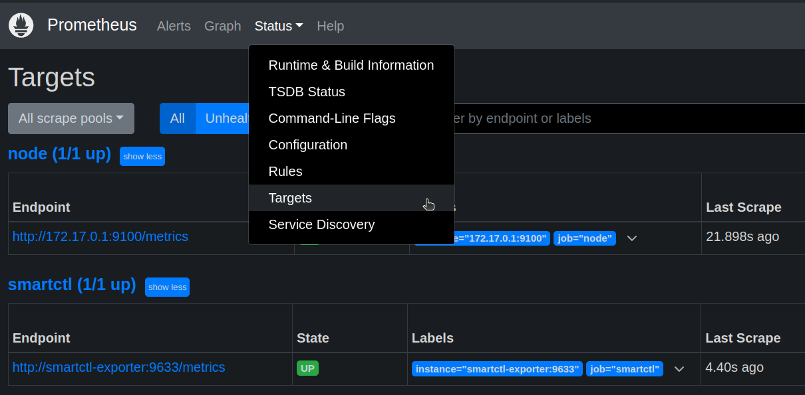
Attention, le node-exporter peut dépasser le temps max de réponse pour prometheus (onglet **Status/Target** pour voir le temps de récupération des métriques "Last Scrape"). Dans ce cas il est possible de réduire le périmètre des métriques, exemple:

**compose.yml**

```yml
#...
  node-exporter:
    container_name: node-exporter
    image: quay.io/prometheus/node-exporter:latest
    restart: unless-stopped
    command:
      - --path.rootfs=/host
      - --collector.disable-defaults
      - --collector.cpu
      - --collector.filesystem
      - --collector.meminfo
      - --collector.hwmon
      - --collector.netdev
    pid: host
    volumes:
      - /etc/localtime:/etc/localtime:ro
      - /etc/timezone:/etc/timezone:ro
      - /:/host:ro,rslave
    network_mode: host
#...
```

Il est aussi possible d'augmenter le délai d'expiration

**prometheus.yml**

```yml
#...
  - job_name: node
    scrape_interval: 40s
    scrape_timeout: 20s
#...
```


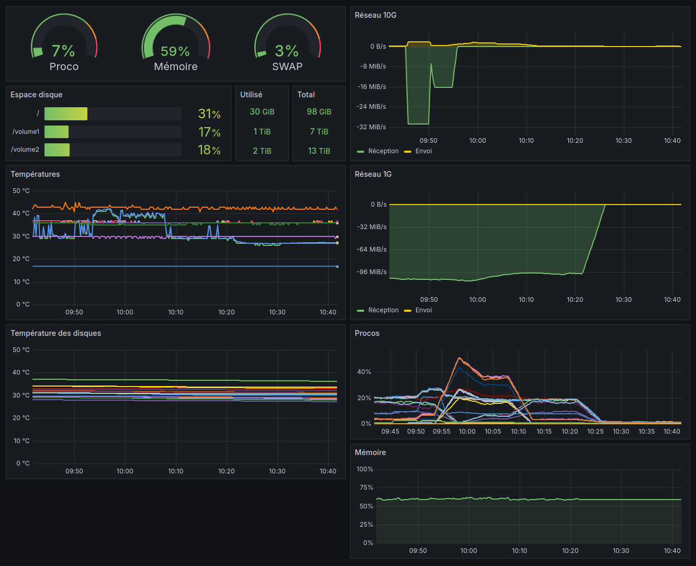

## Samba/CIFS

Voila une manière simple de créer une instance Samba avec Docker

**compose.yml**

```yml
services:
  samba:
    image: ghcr.io/servercontainers/samba:latest
    container_name: samba
    restart: unless-stopped
    environment:
      ACCOUNT_glide: <hash-user>
        [volume1]
          path = /volume1
          valid users = glide
          read only = no
    volumes:
      - /volume1:/volume1
    ports:
      - 445:445
```

Replacer les occurrences de `glide` et `volume1` respectivement par l'utilisateur et le partage voulus.

Générer le `<hash-user>` avec la commande suivante:

```
docker run -ti --rm --entrypoint create-hash.sh ghcr.io/servercontainers/samba
```

Plus d'information sur le [Github](https://github.com/ServerContainers/samba)

## Photos

[Immich](https://github.com/immich-app/immich) est un système de gestion de photos moderne et populaire, il permet (parmis [tant d'autres fonctionnalités](https://github.com/immich-app/immich?tab=readme-ov-file#features)) de:
- Parcourir les photos par chronologie (à la Google photo) ou par album
- Créer des albums et les partager
- Automatiser la sauveguarde des photos des téléphones
- Reconnaitre les visages, formes, objets, couleur et attacher des metadonnées en conséquence

**compose.yml**

```yml
services:
  immich-server:
    container_name: immich_server
    image: ghcr.io/immich-app/immich-server:${IMMICH_VERSION:-release}
    command: ['start.sh', 'immich']
    volumes:
      - ${UPLOAD_LOCATION}:/usr/src/app/upload
      - /etc/localtime:/etc/localtime:ro
      - /volume1/Photos:/volume1/Photos:ro
    env_file:
      - .env
    ports:
      - 2283:3001
    depends_on:
      - redis
      - database
    restart: unless-stopped

  immich-microservices:
    container_name: immich_microservices
    image: ghcr.io/immich-app/immich-server:${IMMICH_VERSION:-release}
    # extends: # uncomment this section for hardware acceleration - see https://immich.app/docs/features/hardware-transcoding
    #   file: hwaccel.transcoding.yml
    #   service: cpu # set to one of [nvenc, quicksync, rkmpp, vaapi, vaapi-wsl] for accelerated transcoding
    command: ['start.sh', 'microservices']
    volumes:
      - ${UPLOAD_LOCATION}:/usr/src/app/upload
      - /etc/localtime:/etc/localtime:ro
      - /volume1/Photos:/volume1/Photos:ro
    env_file:
      - .env
    depends_on:
      - redis
      - database
    restart: unless-stopped

  immich-machine-learning:
    container_name: immich_machine_learning
    # For hardware acceleration, add one of -[armnn, cuda, openvino] to the image tag.
    # Example tag: ${IMMICH_VERSION:-release}-cuda
    image: ghcr.io/immich-app/immich-machine-learning:${IMMICH_VERSION:-release}
    # extends: # uncomment this section for hardware acceleration - see https://immich.app/docs/features/ml-hardware-acceleration
    #   file: hwaccel.ml.yml
    #   service: cpu # set to one of [armnn, cuda, openvino, openvino-wsl] for accelerated inference - use the `-wsl` version for WSL2 where applicable
    volumes:
      - model-cache:/cache
    env_file:
      - .env
    restart: unless-stopped

  redis:
    container_name: immich_redis
    image: registry.hub.docker.com/library/redis:6.2-alpine@sha256:84882e87b54734154586e5f8abd4dce69fe7311315e2fc6d67c29614c8de2672
    restart: unless-stopped

  database:
    container_name: immich_postgres
    image: registry.hub.docker.com/tensorchord/pgvecto-rs:pg14-v0.2.0@sha256:90724186f0a3517cf6914295b5ab410db9ce23190a2d9d0b9dd6463e3fa298f0
    environment:
      POSTGRES_PASSWORD: ${DB_PASSWORD}
      POSTGRES_USER: ${DB_USERNAME}
      POSTGRES_DB: ${DB_DATABASE_NAME}
    volumes:
      - ${DB_DATA_LOCATION}:/var/lib/postgresql/data
    restart: unless-stopped

  immich-folder-album-creator:
    container_name: immich_folder_album_creator
    image: salvoxia/immich-folder-album-creator:latest
    restart: unless-stopped
    environment:
      API_URL: http://immich_server:3001/api
      API_KEY: <api-key> # À générer depuis l'admin dans le GUI d'Immich
      ROOT_PATH: /volume1/Photos
      CRON_EXPRESSION: "42 17 * * *"
      TZ: Europe/Paris
    volumes:
      - /volume1/Photos:/volume1/Photos:ro
    profiles:
      - donotstart

volumes:
  model-cache:
```

Le service `immich-folder-album-creator` est optionnel. Il permet, comme son nom l'indique, de générer des albums à partir de répertoires existants.

**.env**

```env
UPLOAD_LOCATION=/volume1/immich/library
DB_DATA_LOCATION=/volume1/immich/postgres

IMMICH_VERSION=release

DB_PASSWORD=<pass>

DB_USERNAME=postgres
DB_DATABASE_NAME=<user>
```

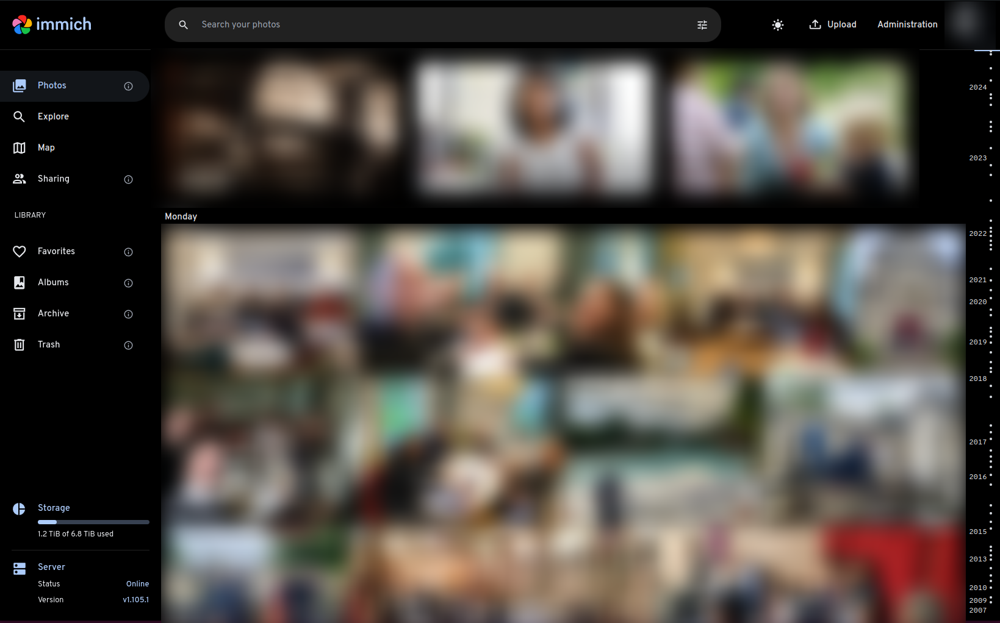

## VPN

Stack pour [Wireguard](https://github.com/linuxserver/docker-wireguard)

**compose.yml**

```yml
services:
  wireguard:
    image: lscr.io/linuxserver/wireguard:1.0.20210914
    container_name: wireguard
    restart: unless-stopped
    cap_add:
      - NET_ADMIN
      - SYS_MODULE
    environment:
      - PUID=1000
      - PGID=1000
    volumes:
      - ./config:/config
    ports:
      - 51820:51820/udp
```

## Gestionnaire de mots de passe

Stack pour [Vaultwarden](https://github.com/dani-garcia/vaultwarden)

**compose.yml**

```yml
services:
  vaultwarden:
    image: vaultwarden/server:1.30.5
    restart: unless-stopped
    container_name: vaultwarden
    volumes:
      - ./data:/data
#    ports:
#      - 3012:3012
    environment:
      - TZ=Europe/Paris
      - WEBSOCKET_ENABLED=true
      - ADMIN_TOKEN=${VAULTWARDEN_ADMIN_TOKEN}

networks:
  default:
    name: traefik # Avec par exemple Traefik comme reverse proxy (Exemple dans la section Traefik)
    external: true
```

## Reverse proxy

Voila l'installation que nous recommandons pour [Træfik](https://doc.traefik.io/traefik/). Elle a les avantages d'être facile à apréhender/maintenir par son découpage et de pouvoir surveiller les services à activer/désactiver et de manière centralisée.

**compose.yml**

```yml
services:
  traefik:
    image: traefik:v3.0.0
    restart: unless-stopped
    container_name: traefik
    environment:
      - TZ=Europe/Paris
      - XDG_CONFIG_HOME=/ # Permet de faire découvrir la config la où elle est montée (/traefik.yml)
    ports:
      - 80:80
      - 443:443
    volumes:
      - ./letsencrypt:/letsencrypt # Emplacement des certificat
      - ./routers:/routers # Répertoire surveillé contenant un fichier par router
      - ./traefik.yml:/traefik.yml # Config principale
      - /var/run/docker.sock:/var/run/docker.sock:ro

networks:
  default:
    name: traefik # Le réseau à rejoindre pour les "backends" concernés
    external: true
```

**traefik.yml**

```yml
log:
#  level: DEBUG
  level: INFO

providers:
  file:
    directory: /routers
    watch: true

entryPoints:
  web:
    address: ":80"
    http:
      redirections:
        entryPoint:
          to: "websecure"
          scheme: "https"
  websecure:
    address: ":443"

certificatesResolvers:
  my: # Nom arbitraire à changer si besoin
    acme:
      tlsChallenge: true
      email: "<mail-de-ladmin>"
      storage: "/letsencrypt/prod.json"
  staging: # Le staging permet de simuler la récupération d'un certificat sans consommer les tentatives potentiellement infructueuses (limitées)
    acme:
      tlsChallenge: true
      email: "<mail-de-ladmin>"
      storage: "/letsencrypt/staging-v2.json"
      caServer: "https://acme-staging-v02.api.letsencrypt.org/directory"
```

Exemple de router pour Vaulwarden

**routers/vaultwarden.yml**

```yml
http:
  routers:
    vaultwarden:
      service: vaultwarden
      rule: "Host(`vaultwarden.<mon-domaine>`)"
      entrypoints: websecure
      tls:
        certResolver: my
  services:
    vaultwarden:
      loadBalancer:
        servers:
          - url: "http://vaultwarden" # "vaultwarden" doit correspondre au nom du service Docker correspondant (son IP sera résolue par le DNS interne de Docker)
```

Bien sûr, il faut remplacer `<mon-domaine>` par le domaine concerné...

Même à chaud, pour ajouter un routeur, il suffit de créer un fichier dans le répertoire `routers` pour que la config soit prise en compte.

La syntaxe YML est plus lisible que les configurations exposées dans des labels sur les services Docker.

## Seedbox

Voila une composition qui permet d'utiliser [Transmission](https://github.com/transmission/transmission) avec **NordVPN** en mode Wireguard.

[Gluetun](https://github.com/qdm12/gluetun) est un client VPN léger qui accepte un grand nombre de protocoles et fournisseurs différents (comme NordVPN).

**compose.yml**

```yml
services:
  nordvpn:
    image: qmcgaw/gluetun
    container_name: torrent-nord
    restart: unless-stopped
    cap_add:
      - NET_ADMIN
    ports:
      - "9092:9091" # Transmission
      - "51413:51413" # Transmision
      - "51413:51413/udp" # Transmision
    environment:
      - VPN_SERVICE_PROVIDER=nordvpn
      - WIREGUARD_PRIVATE_KEY=${WIREGUARD_PRIVATE_KEY}
#      - SERVER_CITIES=Prague
      - VPN_TYPE=wireguard
  transmission:
    image: ghcr.io/linuxserver/transmission
    network_mode: "service:nordvpn"
    container_name: torrent-transmission
    restart: unless-stopped
    depends_on:
      - nordvpn
    environment:
      - PUID=1000
      - PGID=1000
      - TZ=Europe/Paris
    volumes:
      - "./config:/config"
      - "./downloads:/downloads"
      - "./watch:/watch"
```

**.env**

```
WIREGUARD_PRIVATE_KEY=<clé privée>
```

La clé privée Wireguard peut être générée avec un token de cette manière:

```
curl -s -u token:<ACCESS_TOKEN> https://api.nordvpn.com/v1/users/services/credentials
```

Pour utiliser [Qbittorrent](https://github.com/qbittorrent/qBittorrent) à la place de Transmission:

```yml
  qbittorrent:
    image: linuxserver/qbittorrent
    network_mode: "service:nordvpn"
    container_name: torrent-qbit
    restart: unless-stopped
    depends_on:
      - nordvpn
    environment:
      - WEBUI_PORT=8089
      - PUID=1000
      - PGID=1000
      - TZ=Europe/Paris
    volumes:
      - "./config:/config"
      - "./downloads:/downloads"
```

## Sauvegarde

Ici l'idée est d'utiliser [Restic](https://restic.readthedocs.io/en/stable/) avec un stockage en SFTP

### SFTP

Service SSH dockerisé à configurer sur la machine qui accueillira des sauvegardes

**compose.yml**

```yml
services:
  sftp:
    image: atmoz/sftp
    container_name: sftp
    restart: unless-stopped
    volumes:
      - ./sftp/users.conf:/etc/sftp/users.conf:ro
      - ./sftp/backup/<utilisateur>:/home/<utilisateur>/cible # Répertoire de sauvegarde
      - ./sftp/keys/ssh_host_rsa_key:/etc/ssh/ssh_host_rsa_key
      - ./sftp/keys/ssh_host_ed25519_key:/etc/ssh/ssh_host_ed25519_key
      - ./sftp/keys/sftp.<utilisateur>.pub:/home/<utilisateur>/.ssh/keys/id_rsa.pub
    ports:
      - "<port-sftp>:22"
```

- Créer les répertoires de config SSH et de sauvegarde

```
mkdir -p sftp/ssh
mkdir -p sftp/backup/<utilisateur>
```

- Définir les utilisateurs

```
echo "<utilisateur>::<uid>:<gid>:<repertoire>" >> sftp/users.conf

# Exemple
echo "glide::1000:1000:cible" >> sftp/users.conf
```

- Créer les clés

```
ssh-keygen -t ed25519 -f sftp/ssh/ssh_host_ed25519_key < /dev/null
ssh-keygen -t rsa -b 4096 -f sftp/ssh/ssh_host_rsa_key < /dev/null
```

Plus d'infos sur le [Github](https://github.com/atmoz/sftp)

### Restic

Nous évoquerons deux versions, une avec GUI **Backrest** et une sans **Resticker**. 

#### Backrest

Backrest est un GUI au dessus de Restic (inclu dans le service).

**compose.yml**

```yml
services:
  restic:
    image: garethgeorge/backrest
    container_name: backrest
    restart: unless-stopped
    volumes:
      - ./backrest/data:/data
      - ./backrest/config:/config
      - ./backrest/cache:/cache
      - ./backrest/source:/source:ro # Données à sauvegarder
      - ./backrest/ssh:/root/.ssh # Config & clés SSD
    environment:
      - BACKREST_DATA=/data
      - BACKREST_CONFIG=/config/config.json
      - XDG_CACHE_HOME=/cache
      - TZ=Europe/Paris
    ports:
      - "9898:9898"
```

- Créer le répertoire de config SSH

```
mkdir -p backrest/ssh
```

- Générer les clés

```
ssh-keygen -f ./backrest/ssh/id_rsa
```

- Générer le `known_hosts`

```
ssh-keyscan -H -p <port-sftp> <domaine> > ./backrest/ssh/known_hosts
```

- Créer la config SSH dans `backrest/ssh/config`

```
Host <alias>
  Hostname <domaine>
  User <utilisateur>
  Port <port-sftp>
```

- Appliquer les bonnes permissions

```
chmod 700 backrest/ssh
chmod 600 backrest/ssh/*
sudo chown -R root:root backrest/ssh/
```

- Une fois le service lancé, accéder au GUI avec un navigateur sur le port `9898`
- Créer un _Repo_ avec les paramètres suivants

```yml
uri: sftp:<alias>:backup
password: <mot-de-passe-pour-chiffrer-les-sauvegardes>
```

Exemple:

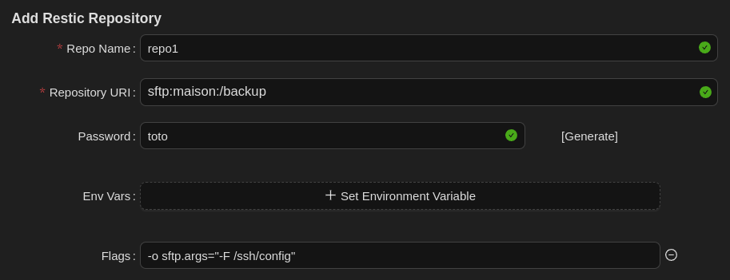

- Et enfin, créer un _Plan_ avec les données à sauvegarder (`/source` défini dans notre compose)

Plus d'infos sur le [Github](https://github.com/garethgeorge/backrest)

#### Resticker

Resticker est un Restic dockerisé sans GUI avec une configurations simplifiée dans des variables d'environnement.

**compose.yml**

```yml
services:
  restic:
    image: mazzolino/restic
    container_name: restic
    hostname: <hote-source>
    restart: unless-stopped
    environment:
#      RUN_ON_STARTUP: "true"
      BACKUP_CRON: "0 30 3 * * *"
      RESTIC_REPOSITORY: sftp:<alias>:backup
      RESTIC_PASSWORD: ${RESTIC_PASSWORD}
      RESTIC_BACKUP_SOURCES: /data
      RESTIC_BACKUP_ARGS: >-
        --verbose
      RESTIC_FORGET_ARGS: >-
        --keep-last 10
        --keep-daily 7
        --keep-weekly 5
#        --keep-monthly 12
      TZ: Europe/Paris
    volumes:
      - ./resticker/source:/data:ro # Données à sauvegarder
      - ./resticker/ssh:/run/secrets/.ssh:ro
```

**.env**

```
RESTIC_PASSWORD=<mot-de-passe-pour-chiffrer-les-sauvegardes>
```

- Créer le répertoire de config SSH

```
mkdir -p resticker/ssh
```

- Générer les clés

```
ssh-keygen -f ./resticker/ssh/id_rsa
```

- Générer le known_hosts

```
ssh-keyscan -H -p <port-sftp> <domaine> > ./resticker/ssh/known_hosts
```

- Créer la config SSH dans `resticker/ssh/config`

```
Host <alias>
  Hostname <domaine>
  User <utilisateur>
  Port <port-sftp>
```

Plus d'informations sur le [Github](https://github.com/djmaze/resticker)

## Domotique

Stack pour [Home Assistant](https://www.home-assistant.io/)

**compose.yml**

```yml
services:
  hass:
    image: homeassistant/home-assistant
    container_name: hass
    restart: unless-stopped
    network_mode: host
    volumes:
      - ./hass-config:/config
      - /etc/localtime:/etc/localtime:ro
      - ./video:/config/www/video
      - ./ssh:/root/.ssh
    devices:
      - /dev/ttyUSB0:/dev/ttyUSB0
```

Remplacer `ttyUSB0` par l'emplacement du dongle USB Zigbee, Z-Wave ou autre.

## Mises à jour

[Diun](https://github.com/crazy-max/diun) permet de surveiller les mises à jour disponibles des services docker (Images).
Il peut en notifier [Gotify](https://github.com/gotify/server) qui peut à son tour envoyer l'information sur téléphone.

**compose.yml**

```yml
services:
  diun:
    image: crazymax/diun:latest
    container_name: diun
    restart: unless-stopped
    command: serve
    volumes:
      - ./diun-data:/data
      - ./diun.yml:/diun.yml:ro # Configuration à créer ci-après
      - /var/run/docker.sock:/var/run/docker.sock
    environment:
      - TZ=Europe/Paris
      - CONFIG=/diun.yml
    depends_on:
      - gotify
  gotify:
    image: gotify/server:latest
    container_name: gotify
    restart: unless-stopped
    volumes:
      - ./gotify-data:/app/data
    environment:
      - TZ=Europe/Paris
    ports:
      - "81:80"
```

**diun.yml**

```yml
watch:
  schedule: "0 * * * *"

providers:
  docker:
    watchByDefault: true

notif:
  gotify:
    endpoint: http://gotify
    token: <token> # À créer depuis le GUI de Gotify
    templateTitle: |
      {{ .Entry.Image.Path }}: {{ if (eq .Entry.Status "new") }}Disponible{{ else }}Nouvelle version{{ end }}
    templateBody: |
      Le tag Docker {{ if .Entry.Image.HubLink }}[**{{ .Entry.Image }}**]({{ .Entry.Image.HubLink }}){{ else }}**{{ .Entry.Image }}**{{ end }} {{ if (eq .Entry.Status "new") }}est disponible{{ else }}a été mis à jour{{ end }} sur le registry {{ .Entry.Image.Domain }}.
```

* Depuis le **GUI de Gotify** (ici sur le port 81):
  * Créer l'utilisateur principal
  * Générer un jeton d'app
  * Et le coller dans diun.yml

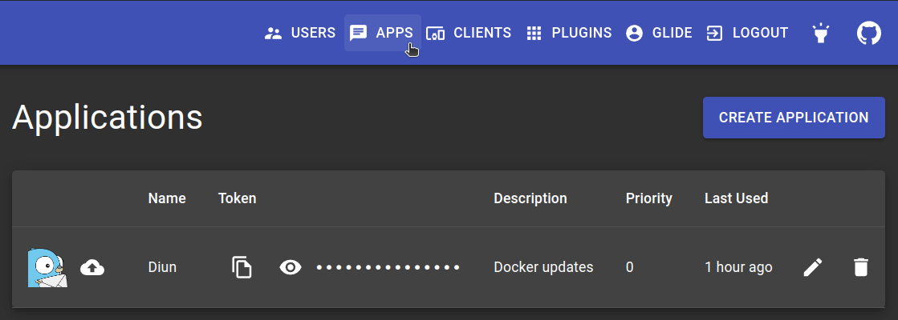

* Depuis le **téléphone**:
  * Installer l'application Gotify
  * Générer un jeton de client (depuis le GUI de Gotify)
  * L'utiliser pour se connecter sur l'application mobile

Dans cet exemple de configuration, toutes les heures Diun va vérifier si il existe une mise à jour pour un des services actifs (en respectant le tag défini), envoyer l'information à Gotify le cas échant qui fera apparaitre la notification sur le téléphone.

Attention aux tags, par exemple si un service Docker a été défini sur le tag 2.5.0 et qu'une version 2.6.0 devient disponible, il n'y aura pas de notification. Ce comportement peut être réglé [ici](https://crazymax.dev/diun/config/)
