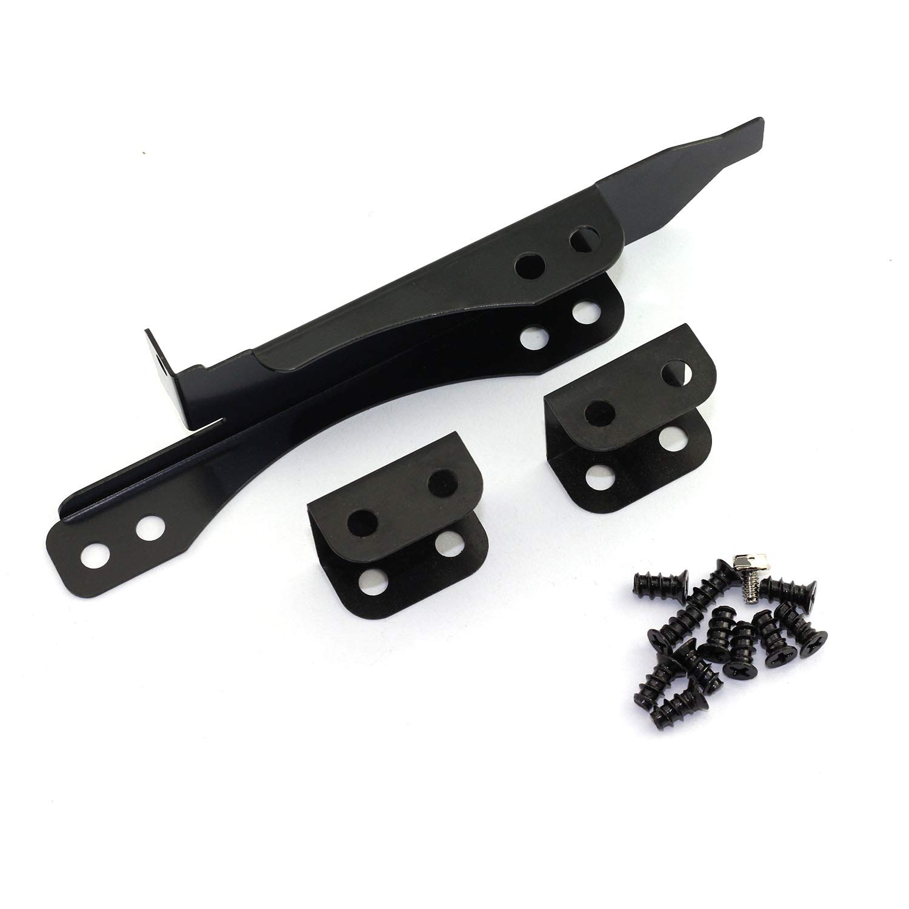

Ici, le but est de trouver les solutions pour créer un serveur à partir de zero autour de disques SAS.

Nous avons essayé de trouver un bon compromis budget (~**500€**) / performance / consommation électrique / bruit.

# Matériel

|                      | Modèle                                  | Prix |                                                        |
|----------------------|-----------------------------------------|-----:|--------------------------------------------------------|
| **Processeur**           | AMD Athlon 220GE                  |  ~50€ | Faible consommation et suffisamment récent                          |
| **Carte mère**           | Gigabyte B450 Aorus Elite V2            | 110€ | Pas toujours évident à trouver                         |
| **Alimentation**         | Be Quiet! Pure Power 11 - 500W - Gold   |  80€ |                                                        |
| **HBA**                  | [LSI SAS 9300-16i](https://fr.aliexpress.com/item/1005005203882356.html)             |  63€ | Pour brancher 16 disques en SAS 3                              |
| **HBA**                  | [LSI SAS 9211-8i](https://fr.aliexpress.com/item/1005005028899772.html)             |  26€ | Pour brancher 8 disques en SAS 2                              |
| **RAM**                  | Corsair Vengeance LPX 3600 MHz par 16Go |  37€ | 8 gigs peuvent suffire même pour Plex                  |
| **NVMe**                 | Crucial 500Go                           |  35€ |                                                        |
| **Boîtier**                 | ATX minimum                      |  ~60€ | Privilégier un bon espace de fixation SSD/HDD et des emplacements pour la ventilation        |
| **Splitters d'alim**     | [Aliex SATA 1 -> 3](https://fr.aliexpress.com/item/1005005766877776.html)                       |   2€ | SATA mieux que Molex                                   |
| **Câbles de données**    | [Aliex **SFF 8643** -> **SFF 8482**](https://fr.aliexpress.com/item/1005004937995975.html)              |   8€ | Par câble pour 4 disques                               |
| **Ventilateur CPU**      | [Aliex AMD EOM](https://fr.aliexpress.com/item/1005005228000756.html)                           |  13€ | Low profile, le 220GE chauffe très peu                 |
| **Adaptateur disque**    | [Aliex 5.25" -> 3.5"-> 2.5"](https://www.aliexpress.com/item/4000087318148.html)              |   7€ | Pour baie 5.25"                                        |
| **Ventilos 12cm**         | [Younuon 4 pin PWM](https://fr.aliexpress.com/item/4000561653138.html)                       |   9€ | Semblent bruyants, comparer avec Noctua                |
| **Rivets ventilos**      | [Aliex caoutchouc \*20](https://fr.aliexpress.com/item/1005002787135032.html)                    |   3€ |                                                        |
| **Chassis pour ventilo** | [Aliex adaptateur sur slot](https://fr.aliexpress.com/item/1005005868217402.html)               |   3€ | Pour ventiler le HBA                                   |
| **Splitter de ventilo**  | [Aliex 1 -> 2](https://fr.aliexpress.com/item/1005004621361878.html)                            |   1€ | La carte mère n'a que 4 connecteurs dont 1 pour le CPU |
| **Carte réseau 10Gb**  | [Aliex Intel X520](https://fr.aliexpress.com/item/1005005503868174.html)                            |   35€ |  |
| **Câble DAC**  | [Aliex 3 mètres](https://fr.aliexpress.com/item/1005006118860005.html)                            |   13€ |  |

# Le contrôleur SAS: HBA

Le HBA est le contrôleur qui permet à la carte mère de communiquer en SAS. Les cartes mères grand publique ne gèrent que le SATA par défaut.

Le nom de code de la carte est en général de cette forme: **9XYY-Zi**

- **X** est la version du SAS: 2, 3, 4, ...
- **YY** est la révision du modèle
- **Z** est le nombre de disques connectables: 4, 8, 16, ...

Exemples:

- **9300-16i** SAS**3**, **première** révision, **16** disques (4 connecteurs "mini SAS")
- **9217-8i** SAS**2**, révision **17**, **8** disques (2 connecteurs)

Attention ces cartes peuvent atteindre \~80° sans ventilation, penser à y mettre un 12cm dédié avec un adaptateur slot (50° ventilée), même si elle est censé supporter jusqu'à 110°

## SAS 3

Le SAS 3 permet théoriquement d'atteindre **12Gb/s**

Exemple de HBA SAS 3: **LSI SAS 9300-16i**


Cette carte possède 4 connecteurs mini SAS (**SFF 8643**) qui permettent de brancher 4 disques chacun

## SAS 2

Le SAS 3 permet théoriquement d'atteindre **6Gb/s**

Exemple de HBA SAS 2: **LSI SAS 9211-8i**


Sur cette carte on peut voir 2 connecteurs **SFF-8087** qui est l'ancien format du mini SAS mais encore très répandu à priori. Donc ici il est possible de brancher 8 disques.

## Expander

Il est aussi possible d'étendre le nombre de connecteurs avec une carte dédiée.  

Exemple de SAS expander


Ici, les 2 connecteurs du haut Port 0 et Port 1 sont des entrées (à brancher sur des sorties du HBA), une seule peut suffire mais il faut s'assurer que le débit est suffisant.

Il faut savoir que les SAS expanders n'utilisent le slot PCIe que pour l'alimentation, les données transitent par le HBA avant d'arriver sur les ports d'entrée.

# Fixation des disques

À défaut de disposer d'une cage avec fond de panier ([backplane](https://www.monsieurcyberman.com/fr/95-backplane-serveur)) comme dans les machines 19" d'entreprise, l'idéal est de les fixer dans la facade pour pouvoir les ventiler plus facilement (surtout pour les SSD qui chauffent plus)


Cette platine 5.25" permet de visser 2 ou 4 SSD (je préfère me limiter à 2 pour permettre aux disques de respirer) ou un HDD au milieu

Il existe aussi ce type de cages:


# Raid

Il est possible de faire du Raid classique ou du RaidZ

## Raid classique

TODO

## RaidZ

Plus d'informations [ici](https://resinfo-gt.pages.in2p3.fr/zfs/doc/index.html)

- Installer les outils

```bash
$ sudo apt install zfsutils-linux
```

- Nommer les disques (pour éviter d'utiliser la forme `sdx` qui peut changer et pouvoir les retrouver plus facilement dans le boitier)

```bash
$ nano /etc/zfs/vdev_id.conf
```

```bash
alias SSD11 scsi-SNETAPP_X439_PHM23T0MCTO_75P0A056G32B
alias SSD12 scsi-SNETAPP_X439_PHM23T0MCTO_85D0A00IG32B
alias SSD13 scsi-SNETAPP_X439_PHM23T0MCTO_85D0A00NG32B
alias SSD14 scsi-SNETAPP_X439_PHM23T0MCTO_65L0A00BG32B
alias SSD21 scsi-SNETAPP_X439_PHM23T0MCTO_85F0A04FG32B
alias SSD22 scsi-SNETAPP_X439_PHM23T0MCTO_65M0A040G32B
alias SSD23 scsi-SNETAPP_X439_PHM23T0MCTO_65L0A00FG32B
alias SSD24 scsi-SNETAPP_X439_PHM23T0MCTO_75P0A01BG32B
alias SSD31 scsi-SNETAPP_X439_PHM23T0MCTO_Y5M0A034G32B
alias SSD32 scsi-SNETAPP_X439_PHM23T0MCTO_65L0A01DG32B
alias SSD33 scsi-SNETAPP_X439_PHM23T0MCTO_65L0A02DG32B
alias SSD34 scsi-SNETAPP_X439_PHM23T0MCTO_X5O0A03TG32B
alias SSD41 scsi-SNETAPP_X439_PHM23T0MCTO_7580A071G32B
alias SSD42 scsi-SNETAPP_X439_PHM23T0MCTO_85F0A03UG32B
alias SSD43 scsi-SNETAPP_X439_PHM23T0MCTO_65M0A020G32B
alias SSD44 scsi-SNETAPP_X439_PHM23T0MCTO_85D0A01PG32B
```

Ici les disques ont été nommés sous la forme SSD**XY**
- **X** étant le connecteur mini SAS du HBA
- **Y** le connecteur **SFF-8482** en général identifié avec une étiquette


- Prendre en compte nos vdevs renommés

```bash
sudo udevadm trigger
```

- Créer les volumes

```bash
sudo zpool create volume1 raidz SSD41 SSD42 SSD43 SSD44 SSD33 SSD34
sudo zpool create volume2 raidz SSD11 SSD12 SSD13 SSD14 SSD21 SSD22 SSD23 SSD24 SSD31 SSD32
```

- Les volumes sont maintenant visibles et utilisables dans `/volume1` & `/volume2`

# Surveillance

Plusieurs choses sont intéressantes à surveiller, exemples:

- Les températures
  - Disques
  - HBA
  - CPU
- L'état des raids
- Les débits réseau entrant et sortant

## Prometheus & Grafana

2 outils sont mis à contribution:
- **Prometheus** pour la récupération des données
- **Grafana** pour l'affichage

Voila un exemple de config:

**docker-compose.yml**

```yml
services:

  node-exporter:
    container_name: node-exporter
    image: quay.io/prometheus/node-exporter:latest
    restart: unless-stopped
    command:
      - --path.rootfs=/host
    pid: host
    volumes:
      - /etc/localtime:/etc/localtime:ro
      - /etc/timezone:/etc/timezone:ro
      - /:/host:ro,rslave
    network_mode: host

  smartctl-exporter:
    container_name: smartctl-exporter
    image: prometheuscommunity/smartctl-exporter
    restart: unless-stopped
    privileged: true
    user: root
    ports:
      - "9633:9633"

  prometheus:
    container_name: prometheus
    image: prom/prometheus
    restart: unless-stopped
    volumes:
      - "./prometheus.yml:/etc/prometheus/prometheus.yml"
      - "prometheus-data:/prometheus"
    ports:
      - 9090:9090

  grafana:
    container_name: grafana
    image: grafana/grafana
    restart: unless-stopped
    depends_on:
      - prometheus
    ports:
      - 3000:3000
    volumes:
      - grafana-data:/var/lib/grafana

volumes:
    prometheus-data:
    grafana-data:
```

- `node-exporter` récupère les métriques classiques du système, il doit tourner directement sur le contexte de l'hôte pour avoir accès au matériel de manière non cloisonnée
- `smartctl-exporter` récupère les métriques des disques
- `prometheus` rassemble les données et les met à disposition de Grafana
- `grafana` vient lire les données sur Prometheus

**prometheus.yml**

```yml
global:
  scrape_interval: 15s

scrape_configs:
  - job_name: node
    static_configs:
    - targets:
      - 172.17.0.1:9100
  - job_name: smartctl
    static_configs:
    - targets:
      - smartctl-exporter:9633
```

Comme `node-exporter` tourne sur l'hôte on utilise ici l'IP de l'hôte 172.17.0.1 par défaut définie par Docker.  
On est censé [pouvoir y accéder par `host.docker.internal`](https://stackoverflow.com/a/24326540/305189) mais ça n'a pas fonctionné chez moi.

## Températures

Depuis un terminal il est possible de voir les températures de toutes les sondes (HBA, disques, processeur, NVMe, etc.)

### HBA

Si le HBA est un LSI il faut installer l'outil Storcli de Broadcom:

- Récupérer l'archive qui contient tous les builds depuis [le site de Broadcom](https://docs.broadcom.com/docs/1232743501) (accepter les conditions)
- Localiser le package correspondant à la distrib Linux
- Installer le package (ici pour Ubuntu)
```
sudo dpkg -i ./storcli_007.2707.0000.0000_all.deb
```
- L'exécutable sera installé dans `/opt/MegaRAID/storcli/storcli64`
- Utiliser l'exécutable
```
sudo /opt/MegaRAID/storcli/storcli64 /c0 show temperature
```
`/c0` correspond au premier HBA, attention le **9300-16i** contient 2 modules (1 pour 2 connecteurs SAS) et donc 2 sondes de température
- Pour voir le 2ème
```
sudo /opt/MegaRAID/storcli/storcli64 /c1 show temperature
```

Exemple:

```
$ sudo /opt/MegaRAID/storcli/storcli64 /c0 show temperature | grep temp

ROC temperature(Degree Celsius) 51
```
_Le premier module est ici à 51°_

### Disques

La récupération des détails des disques peut se faire avec le package `smartmontools`

- Installer `smartmontools`
```
sudo apt install smartmontools
```
- Lire les détails sur un \<disque\>
```
sudo smartctl -A /dev/disk/by-vdev/<disque>
```
- Récupérer la température actuelle
```
sudo smartctl -A /dev/disk/by-vdev/<disque> | grep "Drive Temp"
```

Exemple:

```
$ sudo smartctl -A /dev/disk/by-vdev/SSD11

Current Drive Temperature:     32 C
```

Exemple de script shell pour récupérer les températures de 16 disques nommés `SSD<XY>`

```sh
#!/bin/bash
for y in 1 2 3 4
do
    for x in 1 2 3 4
    do
#        smartctl -a /dev/disk/by-vdev/SSD$x$y
         temp=`smartctl -A /dev/disk/by-vdev/SSD$x$y | grep "Drive Temp" | sed -n "s/^.*\:\s*//p" | sed -n "s/ C$//p"`
         echo -n "SSD$x$y: $temp°   "
         [ "$x" = "4" ] && echo ""
    done
done
```

Résultat:

```
SSD11: 33°   SSD21: 29°   SSD31: 32°   SSD41: 32°   
SSD12: 32°   SSD22: 31°   SSD32: 27°   SSD42: 29°   
SSD13: 30°   SSD23: 30°   SSD33: 26°   SSD43: 28°   
SSD14: 29°   SSD24: 29°   SSD34: 27°   SSD44: 27°   
```

### Autres composants

Les autres composants peuvent être vérifiés à l'aide `lm-sensors`

- Installer `lm-sensors`

```
sudo apt install lm-sensors
```

- Lancer la détection des composants

```
sudo sensors-detect
```

- Laisser les réponses par défaut
- Répondre seulement **yes** à la question

> Do you want to add these lines automatically to /etc/modules?

- Lire les résultats

```
sensors
```

Exemple:

```
$ sensors

amdgpu-pci-0c00
Adapter: PCI adapter
vddgfx:           N/A  
vddnb:            N/A  
edge:         +26.0°C  

it8792-isa-0a60
Adapter: ISA adapter
in0:           1.79 V  (min =  +0.00 V, max =  +2.78 V)
in1:           1.30 V  (min =  +0.00 V, max =  +2.78 V)
in2:           1.19 V  (min =  +0.00 V, max =  +2.78 V)
+3.3V:         3.36 V  (min =  +0.00 V, max =  +5.56 V)
in4:           1.27 V  (min =  +0.00 V, max =  +2.78 V)
in5:           1.15 V  (min =  +0.00 V, max =  +2.78 V)
in6:           2.78 V  (min =  +0.00 V, max =  +2.78 V)  ALARM
3VSB:          3.33 V  (min =  +0.00 V, max =  +5.56 V)
Vbat:          3.10 V  
fan1:           0 RPM  (min =    0 RPM)
fan2:           0 RPM  (min =    0 RPM)
fan3:           0 RPM  (min =    0 RPM)
temp1:        +29.0°C  (low  = +127.0°C, high = +127.0°C)  sensor = thermistor
temp2:        +36.0°C  (low  = +127.0°C, high = +127.0°C)  sensor = thermistor
temp3:        +35.0°C  (low  = +127.0°C, high = +127.0°C)  sensor = thermistor
intrusion0:  ALARM

acpitz-acpi-0
Adapter: ACPI interface
temp1:        +16.8°C  

k10temp-pci-00c3
Adapter: PCI adapter
Tctl:         +26.4°C  

nvme-pci-0b00
Adapter: PCI adapter
Composite:    +34.9°C  (low  =  -0.1°C, high = +84.8°C)
                       (crit = +94.8°C)
Sensor 1:     +34.9°C  (low  = -273.1°C, high = +65261.8°C)
Sensor 2:     +40.9°C  (low  = -273.1°C, high = +65261.8°C)
Sensor 8:     +34.9°C  (low  = -273.1°C, high = +65261.8°C)
```

# Ventilation

Faire entrer l'air par l'avant sur les disques et le faire sortir à l'arrière et/ou vers le haut


Attention à l'orientation des ventilos, on peut la voir en général en relief


Pour ventiler le HBA il est possible d'utiliser ce type d'adaptateur qui se fixe sur un slot du boitier (au niveau des PCI):



Avec cet adaptateur, il est possible de chainer 2 ventilateurs côte à côte.

## PWM

La gestion de la vitesse des ventilateurs est normalement possible avec `pwmconfig` (qui est installé avec `lm-sensors` mentionné dans les [Autres composants](#autres-composants))

Mais je n'ai pas réussi à récupérer quoique ce soit avec la carte mère **B450 AORUS ELITE V2**

# Réseau

Le **SAS 3** permet un débit théorique de 1Go/s. En pratique j'ai pu atteindre **500Mo/s** en écriture avec SSD SAS 3 (simple rsync d'un gros fichier et sans raid).

Avec la bonne boite internet (exemple Freebox Delta), il suffit donc d'avoir une **carte réseau 10Gb** avec le bon câble pour permettre une vitesse de téléchargement élevée.

En termes d'interface, il existe des **cartes SFP+** à 35€ sur Aliexpress (exemple en lien dans le tableau du matériel)


Attention ces interfaces grand publique **ne gèrent pas le WOL**, j'ai personnellement laissé l'ethernet 1Gb intégré à la carte mère branché pour garder cette fonctionnalité.

Si la machine n'est pas trop éloignée du routeur (pas plus de **10m**) l'idéal est d'utiliser un **câble DAC**. Il a l'avantage de moins faire consommer et moins chauffer les interfaces. Sinon il faut passer sur de la fibre qui requiert des modules de chaque coté pour convertir le signal électrique en lumière et inversement.

Ici un DAC sur Aliexpress (3m -> **13€**)


Test de débit avec Speedtest

